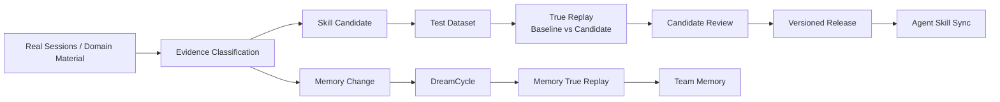
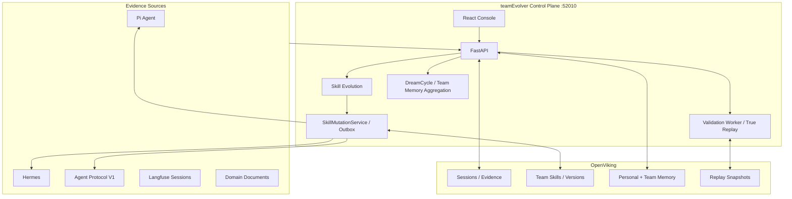

# teamEvolver

<div align="center">

### The Capability Evolution Control Plane for Agent Teams

[](https://www.python.org/)
[](https://fastapi.tiangolo.com/)
[](https://react.dev/)
[](https://github.com/volcengine/OpenViking)
[](./LICENSE)
[](./README.md)

**Turn real Agent Sessions into reusable, validated, and governed team Skills and team Memory.**

</div>

---

## Product

teamEvolver runs outside the Agent runtime and owns continuous capability evolution and governance. It receives real Sessions and domain material, extracts traceable Evidence, proposes Skill Candidates or Memory Changes, and closes the loop through static checks, True Replay, optional human gates, versioned publication, and controlled distribution.

It is neither another Agent runtime nor a file synchronization script:

- Agents keep their own models, tools, workspaces, and execution loops.
- teamEvolver owns Evidence, evolution, validation, versions, audit, and release.
- OpenViking stores team Skills, Memory, Sessions, and replay snapshots.
- Langfuse can independently provide Session ingestion and evolution observability.

## Evolution Loop



A Checklist is a completion gate, not a weighted score. Once the gate passes, True Replay compares efficiency by interaction turns, tool calls, and total tokens, in that order.

## Core Capabilities

| Module | Current capability |
| --- | --- |
| Sessions and Evidence | V1 Session ingest, Langfuse pull, value classification, recent/historical Evidence windows, filter audit |
| Skill Evolution | Summarize, judge, group, improve/create/merge, and same-source Test Dataset synthesis |
| True Replay | Run Baseline and Candidate in the real Agent Runtime; inspect Checklist completion, traces, artifacts, and efficiency |
| Candidate Governance | Review, replay-gated or forced publish, version detail, full Bundle diff, rollback, and audit |
| Memory Evolution | DreamCycle maintenance, cross-user team-memory aggregation, editable aggregation Skill, incremental compilation, and Memory Replay |
| Agent Workspace | Browse personal/team Skills, Memory, and Resources in one file manager with multi-file Diff review and batch save |
| Skill / Memory Lab | Build datasets from historical Sessions and run Baseline/Candidate True Replay on Skill or Memory drafts |
| SkillMiner | Compile domain documents into Skills, semantic reports, `EVALUATION.md`, and internal Benchmarks |
| Agent Protocol V1 | Registration, identity mapping, Context, Session ingest, Replay Branch, and Skill Sync |
| Observability | Langfuse Session import plus model, tool, Skill Evolution, and DreamCycle tracing |

Every team Skill mutation goes through `SkillMutationService`, which owns commit records, tombstones, a durable outbox, and per-Agent delivery state.

## Console

### Operations Overview

The complete Session queue and history, pending candidates, replay decisions, and Skill versions.

<a href="./docs/assets/teamEvolver-console-dashboard.png">
  
</a>

### White-box Evolution Pipeline

The complete Skill Evolution pipeline, eight editable prompts, model and process settings, and real input/output testing.

<a href="./docs/assets/teamEvolver-evolution-pipeline.png">
  
</a>

## Architecture



The console, evolution engine, validation queue, DreamCycle, SkillMiner, and Agent integrations share one FastAPI service and one configuration source.

## Quick Start

Requires Python 3.10+. The full install provisions Hermes inside the project virtual environment for document mining and True Replay.

```bash
git clone https://github.com/leoriczhang/teamEvolver.git
cd teamEvolver

python3 -m venv .venv
source .venv/bin/activate
python -m pip install -U pip
python -m pip install -e ".[all]"

teamEvolver config service.port 52010
teamEvolver start --daemon
teamEvolver status
```

Open `http://127.0.0.1:52010/`. The first visit opens the administrator bootstrap screen. The form defaults to `admin`; use a strong password in production. After signing in, configure:

1. **Global Model**: OpenAI-compatible Base URL, model, and API key.
2. **Runtime Status → OpenViking Deployment**: choose Volcengine Cloud or self-hosted. For a remote self-hosted server, set the endpoint override, for example `http://10.0.0.8:1933`.
3. **Users & Permissions**: configure users, roles, Agent Subject mappings, and personal/team Workspace bindings. Local Trusted mode can reuse the service key instead of requiring one key per user.
4. **Agent Integration**: register runtimes and enable Session, Context, Replay, and Skill Sync.
5. **Langfuse Integration**: optionally enable Session pull, outbound tracing, or a custom Trace mapper.

The console is organized into five areas:

| Area | Main entries |
| --- | --- |
| Skill Mining | Overview, knowledge sources, mining jobs |
| Evolution Loop | Operations, candidate review, evolution/filter audit, Langfuse, Skill/team-Memory evolution |
| Asset Center | Agent Workspace, Skill Lab, Memory Lab, platform assets |
| Governance | Global model, users and permissions, runtime status |
| Documentation | Built-in bilingual reader and search |

Common commands:

```bash
teamEvolver status
teamEvolver doctor
teamEvolver config show
teamEvolver stop
```

The repository includes the production console build. Run the frontend build only when changing `web-ui/`.

Docker Compose is also supported. The image builds the console, installs the full Python dependency set, bundles the OpenViking CLI, and stores runtime data under the repository's `runtime/` directory:

```bash
docker compose up -d --build
docker compose ps
```

## Agent Integration

Use [Agent Integration Protocol V1](./docs/en/agent-integrations/02-protocol-v1.md):

| Capability | Agent responsibility |
| --- | --- |
| `session.ingest.v1` | Submit complete Sessions, tool traces, tokens, Skill usage, and Context references |
| `context.workspace.v1` | Resolve and read personal/team Context through short-lived `context_ref` values |
| `replay.branch.v1` | Synchronously execute one isolated Baseline or Candidate branch |
| `skill.sync.v1` | Receive released Bundles and verify version plus SHA-256 before installation |

A V1 token identifies an Integration, never a user. Each request supplies a stable `external_subject`, mapped by an administrator:

```text
integration_id + external_subject -> teamEvolver user
```

OpenViking credentials, model credentials, and team-Memory write privileges remain on the teamEvolver server.

## Safety and Consistency

- Replay materializes only the required runtime configuration, never a complete production database.
- Candidate processes do not receive upstream model credentials; model access uses an ephemeral broker.
- External side effects fail closed unless they can be replayed deterministically.
- Context references are server-issued and bound to Integration, Subject, Session, and expiry.
- Team Memory and team Skills are read-only to regular Agents; personal-Memory writes require Subject mapping.
- Skill publish, rollback, delete, and sync use one mutation path and a durable outbox.
- Langfuse tracing is fail-open and never blocks evolution or Memory maintenance.

## Repository Layout

```text
teamEvolver/
├── teamEvolver/
│   ├── evolve/          # Evidence, Skill Evolution, Dataset, release
│   ├── validation/      # Candidate queue and True Replay worker
│   ├── dreamcycle/      # Team-Memory evolution and Memory Replay
│   ├── aggregation/     # Cross-user team-Memory aggregation and incremental state
│   ├── integrations/    # Agent V1, Hermes, Langfuse, replay adapters
│   ├── proxy/           # FastAPI, console, and Workspace interfaces
│   ├── config_store/    # YAML defaults, persistence, and runtime bridge
│   ├── skillminer/      # Document-to-Skill mining
│   ├── skills/          # Bundles, versions, and SkillMutationService
│   └── storage/         # OpenViking storage adapters
├── web-ui/              # React + TypeScript console source
├── tests/               # Unit, integration, protocol, and replay tests
└── docs/                # Markdown documentation sources (bilingual zh/en, browsable in-console)
```

## Documentation

Documentation is maintained as Markdown source files in `docs/`, available in both English and Chinese. After logging into the console, the built-in reader under "Docs → Documentation" in the left sidebar supports sidebar tree navigation, full-text search, language switching, and Markdown/GFM/code block/table rendering:

| Section | Content |
| --- | --- |
| Getting Started | [Introduction](./docs/en/getting-started/01-introduction.md), [Quick Start](./docs/en/getting-started/02-quickstart.md), [Installation](./docs/en/getting-started/03-installation.md) |
| Concepts | [Architecture](./docs/en/concepts/01-architecture.md), [Evolution Loop](./docs/en/concepts/02-evolution-loop.md), [Skills](./docs/en/concepts/03-skills.md), [Memory & DreamCycle](./docs/en/concepts/04-memory.md), [True Replay](./docs/en/concepts/06-true-replay.md) |
| Guides | [Configuration](./docs/en/guides/01-configuration.md), [Deployment](./docs/en/guides/02-deployment.md), [Web Console](./docs/en/guides/03-console.md), [Observability](./docs/en/guides/04-observability.md), [Troubleshooting](./docs/en/guides/06-troubleshooting.md) |
| Agent Integrations | [Overview](./docs/en/agent-integrations/01-overview.md), [Protocol V1 Spec](./docs/en/agent-integrations/02-protocol-v1.md), [Hermes Integration](./docs/en/agent-integrations/03-hermes.md), [Custom Agent](./docs/en/agent-integrations/05-custom-agent.md) |
| API Reference | [Overview](./docs/en/api/01-overview.md), [Agent Register](./docs/en/api/02-agent-register.md), [Session Ingest](./docs/en/api/03-session-ingest.md), [Context Workspace](./docs/en/api/04-context-workspace.md), [Skills Admin](./docs/en/api/09-skills-admin.md), [Team Memory Aggregation](./docs/en/api/11-team-memory-aggregation.md) |
| Design Notes | [Master PRD](./docs/design/01-master-prd.md), [DreamCycle Evaluation](./docs/design/02-dreamcycle-snapshot-evaluation.md), [OpenViking Research](./docs/design/03-openviking-capabilities.md) |

### Documentation sync convention

When modifying code, update the corresponding docs following the [Docs Maintenance Guide](./docs/en/api/99-docs-maintenance.md). Run `node docs/scripts/check-docs-refs.mjs` before committing to verify all code references and links are valid.

- [Protocol JSON Schemas](./docs/schemas/)
- [中文文档](./docs/zh/getting-started/01-introduction.md)

## Development Verification

```bash
python -m pip install -e ".[all,dev]"
npm --prefix web-ui ci
bash scripts/verify_local.sh
```

`verify_local.sh` runs Python compilation, the test suite, and the production frontend build.

## License

[MIT](./LICENSE)
