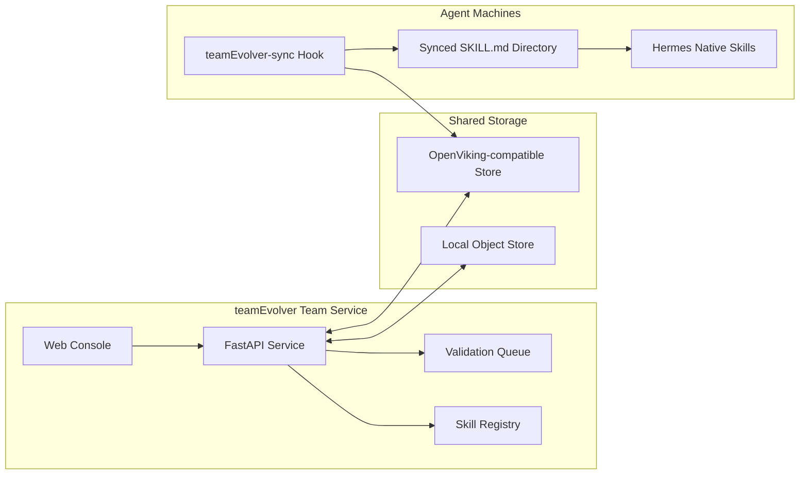
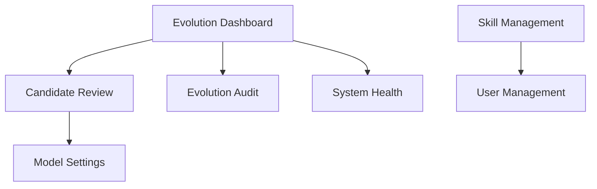
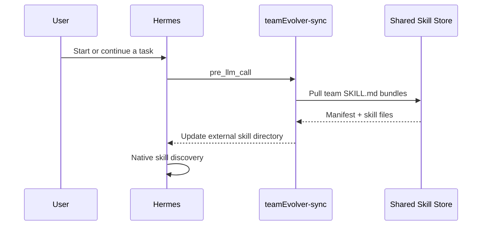
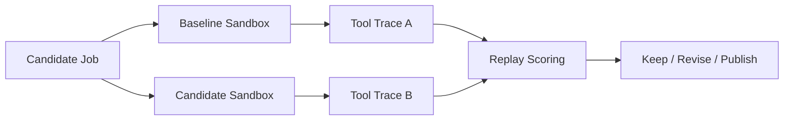

# teamEvolver

<div align="center">

## A Skill Library, Sync Console, and Validation Workbench for Agent Teams

[](https://www.python.org/)
[](https://fastapi.tiangolo.com/)
[](https://react.dev/)
[](./LICENSE)
[](./README.md)

**Turn real agent experience into reusable, synced, validated `SKILL.md` assets for your team.**

</div>

---

## Why teamEvolver?

Agents can already complete complex tasks, but team skills often remain a loose set of files on one machine:

- **Hard to share**: the same experience gets copied across members, machines, and agents.
- **Hard to separate**: personal preferences, customer facts, and team SOPs can mix, creating privacy and contamination risk.
- **Hard to version**: skill origin, publisher, version state, and live team content are difficult to keep aligned.
- **Hard to trust**: a skill may look polished, but there is little evidence that it improves task outcomes.

**teamEvolver is not about making agents remember more; it is a safe pipeline from real sessions to team capability.**
It turns scattered sessions into comparable evidence, separates personal and team assets, and publishes team skills through replay validation and version governance.

---

## Design Principles

- **Central evidence**: retain sessions, tool calls, success strategies, and failure reasons so cross-user patterns become visible.
- **Layered assets**: decide whether knowledge is shareable before deciding whether it should become `skill` or `memory`; personal assets stay isolated, team assets are published deliberately.
- **Validated release**: team `SKILL.md` assets pass aggregation, redaction, deduplication, replay validation, versioning, and rollback gates.

Hermes and other agents keep their native runtime model. teamEvolver delivers team skills through synced directories and hooks, so the agent's native skill system remains in control.

---

## Core Capabilities

<table>
  <tr>
    <td width="25%" valign="top">
      <h3>Skill Library</h3>
      <p>Read, create, edit, delete, package, and import standard <code>SKILL.md</code> bundles while preserving frontmatter and attachments.</p>
    </td>
    <td width="25%" valign="top">
      <h3>Team Sync</h3>
      <p>Use local object storage or OpenViking-compatible object storage with separate personal and team spaces.</p>
    </td>
    <td width="25%" valign="top">
      <h3>Web Console</h3>
      <p>A built-in React + TypeScript console for skills, users, candidate review, health checks, and model settings.</p>
    </td>
    <td width="25%" valign="top">
      <h3>True Replay</h3>
      <p>Run baseline and candidate branches in isolated sandboxes and validate skill changes with real tool trajectories.</p>
    </td>
  </tr>
</table>

---

## Architecture



The recommended path is shared storage, local sync, and native agent loading. Commands such as `skills_list`, `skill_view`, and `/skills` continue to come from the agent itself; teamEvolver only makes sure the team skill library reaches the machine reliably.

---

## Quick Start

### 1. Install

```bash
git clone https://github.com/leoriczhang/teamEvolver.git
cd teamEvolver
python -m venv .venv
source .venv/bin/activate
python -m pip install -U pip
python -m pip install -e ".[all]"
```

Core package only:

```bash
python -m pip install -e .
```

Installer script:

```bash
bash scripts/install_teamEvolver.sh
```

### 2. Configure a Local Skill Library

```bash
teamEvolver config skills.enabled true
teamEvolver config skills.dir ./skills
teamEvolver config sharing.enabled true
teamEvolver config sharing.backend local
teamEvolver config sharing.local_root ./teamEvolver-store
```

### 3. Create a Skill

```bash
mkdir -p skills/example-skill
cat > skills/example-skill/SKILL.md <<'EOF'
---
name: example-skill
description: Use when you need a minimal teamEvolver example.
category: general
---

# Example Skill

Follow the project conventions and keep the answer concise.
EOF
```

### 4. Sync Skills

```bash
teamEvolver skills push
teamEvolver skills list-remote
teamEvolver skills pull
```

### 5. Start the Console

```bash
teamEvolver config service.port 30000
teamEvolver start --daemon
teamEvolver status
```

Open:

```text
http://127.0.0.1:30000/console
```

On first launch, initialize the admin account. The default username and password are both `admin`; change them after deployment.

---

## Console Map

<div align="center">
  
  <br>
  <sub>teamEvolver Console: evolution dashboard, team skill status, storage connectivity, and management entry points.</sub>
</div>



The console includes:

- **Evolution Dashboard**: storage connectivity, skill count, candidate queue, and service status.
- **Candidate Review**: inspect candidate skills before publication, with optional True Replay validation.
- **Evolution Audit**: review skill-evolution records.
- **System Health**: check service, storage, and key API availability.
- **Skill Management**: manage personal and team skills, including zip upload.
- **User Management**: manage users, roles, and personal/team storage credentials.
- **Model Settings**: configure an optional validation model and test connectivity.

---

## Team Skill Sync

Install `teamEvolver-sync` on agent machines. It pulls team skills before each task run and adds the synced directory to the agent's external skill directories.



Install example:

```bash
python teamEvolver/integrations/hermes_skill_sync/install.py \
  --url "http://<teamEvolver-host>:52010" \
  --user "<teamEvolver-user>"
```

The default installer uses the teamEvolver service backend. Local Hermes machines
only need the teamEvolver service URL and teamEvolver user name; OpenViking endpoint,
team key, root prefix, and related shared-storage settings stay on the cloud
teamEvolver service.

The installer writes configuration similar to:

```yaml
skills:
  external_dirs:
    - <HERMES_HOME>/team_skills/teamEvolver
hooks:
  pre_llm_call:
    - command: "python3 <HERMES_HOME>/skills/teamEvolver-sync/sync_skills.py"
      timeout: 60
```

The generated `sync.json` is similar to:

```json
{
  "backend": "service",
  "base_url": "http://<teamEvolver-host>:52010",
  "user_alias": "<teamEvolver-user>",
  "target_dir": "<HERMES_HOME>/team_skills/teamEvolver"
}
```

If the agent is already running, execute `/reload-skills` to refresh the current session cache. New sessions pick up synced skills automatically.

### Session Skill Attribution and Efficiency Metrics

The `teamEvolver-feed` `on_session_end` hook reads the complete Hermes trajectory
from `state.db`, including system, user, assistant, and tool messages:

- `injected_skills`: skills actually exposed in the system prompt's `<available_skills>` block.
- `used_skills`: skills actually loaded through `skill_view`.
- `metrics`: interaction turns, tool-call count, and input/output/cache/reasoning tokens.

After installing `teamEvolver-feed`, these fields are sent through `/ingest_session`
and preserved in the session archive and console details.

---

## OpenViking / Object Storage

Remote sync uses teamEvolver's object-store abstraction. The default endpoint uses VolcEngine-hosted OpenViking:

```bash
teamEvolver config sharing.enabled true
teamEvolver config sharing.backend viking
teamEvolver config sharing.viking_team_api_key "<team-key>"
teamEvolver config sharing.viking_personal_api_key "<personal-key>"
teamEvolver config sharing.viking_root_prefix "teamEvolver"
```

For self-hosted OpenViking Server deployments, see [volcengine/OpenViking](https://github.com/volcengine/OpenViking) and override the default service URL with `teamEvolver config sharing.viking_endpoint "<your-server-url>"`.

Do not commit real API keys. Use local configuration, environment variables, or your deployment platform's secret manager.

---

## True Replay: Validate Skills with Real Trajectories

Plain-text A/B checks can only compare answers. True Replay starts real agents in isolated environments and runs baseline and candidate branches. If a task is incomplete, judge feedback becomes the next user message in the same session. The primary comparison dimensions are:

1. User/agent interaction turns needed to complete the task; fewer is better.
2. Tool-call count; fewer calls usually indicate a more direct execution path.
3. Total tokens, with input/output/cache/reasoning details retained.



Install dependencies:

```bash
python -m pip install -e ".[truereplay]"
```

Replay a shared validation job:

```bash
python -m teamEvolver.true_replay --job-id <validation-job-id> --json
```

Replay a local JSON job file:

```bash
python -m teamEvolver.true_replay --job-file ./candidate_job.json --dry-run
python -m teamEvolver.true_replay --job-file ./candidate_job.json --json
```

True Replay creates temporary `HOME` and `HERMES_HOME` directories for both branches and does not modify your real agent configuration. To use a local agent checkout, set `HERMES_ORIGIN`.

---

## Project Layout

```text
teamEvolver/
├── teamEvolver/
│   ├── cli/              # teamEvolver command line
│   ├── config_store/     # local config store
│   ├── proxy/            # service routes, console, and admin APIs
│   ├── skills/           # SKILL.md management, bundling, sync
│   ├── storage/          # local / OpenViking storage backends
│   ├── integrations/     # Hermes integration
│   ├── validation/       # optional candidate-skill validation
│   ├── true_replay.py    # true A/B replay
│   └── web/              # built console assets
├── web-ui/               # React + TypeScript console source
├── tests/
├── scripts/
└── pyproject.toml
```

---

## Development

```bash
python -m pip install -e ".[dev,all]"
python -m pytest
```

Build the console and Python package:

```bash
npm --prefix web-ui install
npm --prefix web-ui run build
python -m pip install build
python -m build
```

---

## References

Related projects and references:
- [SkillClaw](https://github.com/AMAP-ML/SkillClaw): a multi-agent skill evolution project.
- [OpenSpace](https://github.com/HKUDS/OpenSpace): a quality-first skill hub for AI agents.
- [Hermes Agent](https://github.com/nousresearch/hermes-agent): optional runtime dependency for True Replay.
- [FastAPI](https://fastapi.tiangolo.com/): the teamEvolver service framework.
- [React](https://react.dev/) and [TypeScript](https://www.typescriptlang.org/): the teamEvolver console stack.

---

## License

MIT
