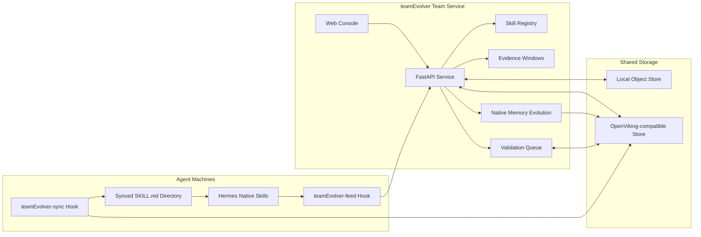
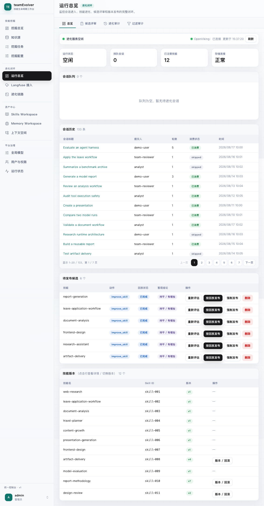
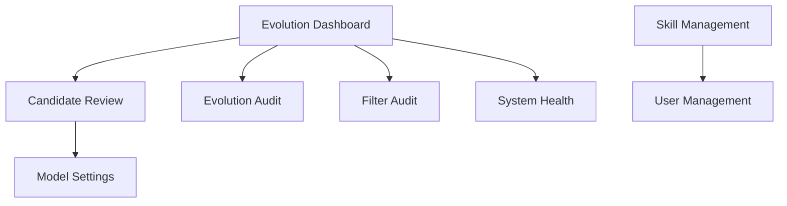
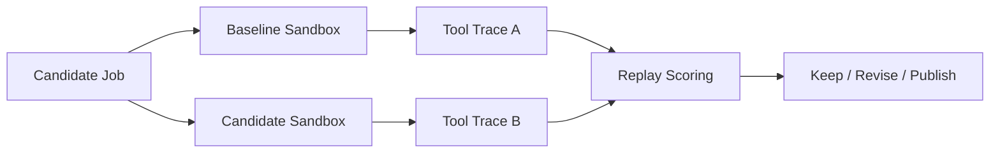

# teamEvolver

<div align="center">

## A Skill Library, Sync Console, DreamCycle, and Validation Workbench for Agent Teams

[](https://www.python.org/)
[](https://fastapi.tiangolo.com/)
[](https://react.dev/)
[](./LICENSE)
[](./README.md)

**Turn real agent experience into reusable, synced, validated `SKILL.md` assets for your team.**

</div>

---

## Table of Contents

- [Why teamEvolver?](#why-teamevolver)
- [Design Principles](#design-principles)
- [Core Capabilities](#core-capabilities)
- [Architecture](#architecture)
- [Manual Installation](#manual-installation)
- [Console Map](#console-map)
- [OpenViking / Object Storage](#openviking--object-storage)
- [Langfuse Sessions and Observability](#langfuse-sessions-and-observability)
- [DreamCycle and Validation Queue](#dreamcycle-and-validation-queue)
- [True Replay: Validate Skills with Real Trajectories](#true-replay-validate-skills-with-real-trajectories)
- [Project Layout](#project-layout)
- [Development](#development)
- [Roadmap](#roadmap)

---

## Why teamEvolver?

Agents can already complete complex tasks, but team skills often remain a loose set of files on one machine:

- **Hard to share**: the same experience gets copied across members, machines, and agents.
- **Hard to separate**: personal preferences, customer facts, and team SOPs can mix, creating privacy and contamination risk.
- **Hard to version**: skill origin, publisher, version state, and live team content are difficult to keep aligned.
- **Hard to trust**: a skill may look polished, but there is little evidence that it improves task outcomes.

**teamEvolver is not about making agents remember more; it is a safe pipeline from real sessions to team capability.**
It turns scattered sessions into comparable evidence, separates personal and team assets, and publishes team skills through replay validation and version governance.

---

## Design Principles

- **Central evidence**: retain sessions, tool calls, success strategies, and failure reasons so cross-user patterns become visible.
- **Layered assets**: decide whether knowledge is shareable before deciding whether it should become `skill` or `memory`; personal assets stay isolated, team assets are published deliberately.
- **Validated release**: team `SKILL.md` assets pass aggregation, redaction, deduplication, replay validation, versioning, and rollback gates.
- **Evidence-first evolution**: new candidates carry recent evidence, historical evidence, and replay cases, so decisions do not depend on one success or one failure.

Hermes and other agents keep their native runtime model. teamEvolver delivers team skills through synced directories and hooks, so the agent's native skill system remains in control.

---

## Core Capabilities

<table>
  <tr>
    <td width="25%" valign="top">
      <h3>Skill Library</h3>
      <p>Read, create, edit, delete, package, and import standard <code>SKILL.md</code> bundles while preserving frontmatter and attachments.</p>
    </td>
    <td width="25%" valign="top">
      <h3>Team Sync</h3>
      <p>Backed by OpenViking object storage with two deployments — cloud (Volcengine-hosted) and local self-hosted — with personal keys as evidence sources and the team key as the publication target.</p>
    </td>
    <td width="25%" valign="top">
      <h3>Web Console</h3>
      <p>A built-in React + TypeScript console for skills, users, candidate review, health checks, and model settings.</p>
    </td>
    <td width="25%" valign="top">
      <h3>True Replay</h3>
      <p>Run baseline and candidate branches in isolated sandboxes and validate skill changes with real tool trajectories.</p>
    </td>
  </tr>
</table>

The default configuration is now shaped for the full loop: skill sync, OpenViking team storage, session filtering, evidence windows, DreamCycle, validation queues, and candidate review can all be connected directly.

---

## Architecture



The recommended path is shared storage, local sync, and native agent loading. Commands such as `skills_list`, `skill_view`, and `/skills` continue to come from the agent itself; teamEvolver only makes sure the team skill library reaches the machine reliably.

---

## Manual Installation

If external network access fails, run:

```bash
export http_proxy="http://sys-proxy-rd-relay.byted.org:8118"
export https_proxy="http://sys-proxy-rd-relay.byted.org:8118"
export no_proxy="localhost,.byted.org,byted.org,.bytedance.net,bytedance.net,127.0.0.0/8,169.254.0.0/16,100.64.0.0/10,172.16.0.0/12,192.168.0.0/16,10.0.0.0/8,::1,fe80::/10,fd00::/8,33.0.0.0/8,2605:340:CD00::/40,64:ff9b::/96,64:ff9b:1::/48"
```

### Server: Deploy teamEvolver

```bash
export TEAMEVOLVER_HOST="<server-ip-or-hostname>"

git clone https://github.com/leoriczhang/teamEvolver.git
cd teamEvolver
python -m venv .venv
source .venv/bin/activate
python -m pip install -U pip
python -m pip install -e ".[all]"
npm --prefix web-ui install
npm --prefix web-ui run build

teamEvolver config service.host 0.0.0.0
teamEvolver config service.port 52010
teamEvolver config skills.enabled true
teamEvolver config skills.dir ./skills
teamEvolver config sharing.enabled true
teamEvolver config sharing.backend viking
teamEvolver config sharing.viking_team_api_key "<team-key>"
teamEvolver config sharing.viking_personal_api_key "<personal-key>"
teamEvolver config sharing.viking_root_prefix "team-skill-evolver"
teamEvolver config evolve.evidence_enabled true
teamEvolver config evolve.evidence_recent_limit 12
teamEvolver config evolve.evidence_historical_limit 12
teamEvolver config evolve.evidence_change_debt_threshold 3
# DreamCycle is native to teamEvolver and disabled by default; no external package is required
# to maintain long-term team memory. Once enabled, it reads personal-key sources and
# writes to the team-key space above.
# Additional AgentsHub peers merge their personal keys through the internal config API.
teamEvolver config dreamcycle.enabled true
teamEvolver config dreamcycle.auto_start true
teamEvolver config validation.enabled true
teamEvolver config validation.mode replay
teamEvolver config validation.required_results 3
teamEvolver config validation.required_approvals 2
teamEvolver config validation.agentshub_url "http://<agentshub-host>:5173"

mkdir -p skills
teamEvolver start --daemon --port 52010
teamEvolver status
curl -fsS "http://127.0.0.1:52010/health"
curl -fsS "http://127.0.0.1:52010/status"
curl -fsS "http://127.0.0.1:52010/trigger-dreamcycle/status"
```

```text
http://<server-ip-or-hostname>:52010/console
```

On first launch, initialize the admin account. The default username and password are both `admin`; change them after deployment.

### Client: Deploy Hermes

```bash
export TEAMEVOLVER_REPO="/path/to/teamEvolver"
export HERMES_HOME="${HERMES_HOME:-$HOME/.hermes}"
export TEAMEVOLVER_URL="http://<server-ip-or-hostname>:52010"
export TEAMEVOLVER_USER="<unique-user-alias-for-this-machine>"
export TEAMEVOLVER_API_KEY=""
TEAMEVOLVER_AUTH_ARGS=()
[ -n "$TEAMEVOLVER_API_KEY" ] && TEAMEVOLVER_AUTH_ARGS=(--api-key "$TEAMEVOLVER_API_KEY")

python "$TEAMEVOLVER_REPO/teamEvolver/integrations/hermes_skill_sync/install.py" \
  --hermes-home "$HERMES_HOME" \
  --python python3 \
  --backend service \
  --url "$TEAMEVOLVER_URL" \
  --user "$TEAMEVOLVER_USER" \
  "${TEAMEVOLVER_AUTH_ARGS[@]}"

python "$TEAMEVOLVER_REPO/teamEvolver/integrations/hermes_skill/install.py" \
  --hermes-home "$HERMES_HOME" \
  --python python3 \
  --user "$TEAMEVOLVER_USER" \
  --url "$TEAMEVOLVER_URL" \
  "${TEAMEVOLVER_AUTH_ARGS[@]}"

python "$HERMES_HOME/skills/teamEvolver-sync/sync_skills.py"
hermes hooks list
curl -fsS "$TEAMEVOLVER_URL/status"
```

If Hermes is already running, execute this in the Hermes session:

```text
/reload-skills
```

Full coding agent integration instructions live in [docs/coding-agent.en.md](./docs/coding-agent.en.md).

---

## Console Map

<div align="center">
  
  <br>
  <sub>teamEvolver Console: evolution dashboard, team skill status, storage connectivity, and management entry points.</sub>
</div>



The console includes:

- **Evolution Dashboard**: storage connectivity, skill count, candidate queue, and service status.
- **Candidate Review**: inspect candidate skills before publication, with optional True Replay validation.
- **Evolution Audit**: review skill-evolution records.
- **Filter Audit**: review valuable / chitchat decisions, mode, confidence, and reasons before sessions enter evolution.
- **System Health**: check service, storage, and key API availability.
- **Skill Management**: manage personal and team skills, including zip upload.
- **Memory Management**: manage personal and shared team memory files through OpenViking.
- **OpenViking Workspace**: browse personal, team, and Skill context trees and open the full Studio.
- **User Management**: manage the team display name, users, roles, and personal/team storage credentials.
- **Model Settings**: configure an optional validation model and test connectivity.

Administrators can edit the team display name under **Users & Permissions →
Team Identity**, or set it through the CLI:

```bash
teamEvolver config team.display_name "My Team"
```

Deployments may override the persisted value with `EVOLVE_TEAM_DISPLAY_NAME`.
DreamCycle uses the effective name in team overviews, prompts, and Memory
sanitization.

---

## OpenViking / Object Storage

Remote sync uses teamEvolver's object-store abstraction. The default endpoint uses VolcEngine-hosted OpenViking:

```bash
teamEvolver config sharing.enabled true
teamEvolver config sharing.backend viking
teamEvolver config sharing.viking_team_api_key "<team-key>"
teamEvolver config sharing.viking_personal_api_key "<personal-key>"
teamEvolver config sharing.viking_root_prefix "team-skill-evolver"
```

OpenViking space roles:

- `sharing.viking_personal_api_key`: the current machine or user's personal evidence source.
- `sharing.viking_team_api_key`: the shared target for team skills, validation jobs, validation results, and DreamCycle output.
- `sharing.viking_root_prefix`: the cross-agent namespace, defaulting to `team-skill-evolver`.

Agents register their runtime type, capabilities, replay endpoint, and Skill-sync endpoint through `/internal/agents/register`. The legacy `/internal/agentshub/openviking-config` route remains as an AgentsHub compatibility adapter. In local deployment mode, teamEvolver owns the OpenViking connection and external Agents cannot replace its endpoint or credentials.

For the local open-source deployment, use the checked-out OpenViking source and its bundled Web Studio:

```bash
bash scripts/start_local_openviking.sh
teamEvolver config sharing.viking_deployment local
teamEvolver config sharing.viking_endpoint ""
teamEvolver start
```

The script defaults to `~/OpenViking` and `~/.openviking/ov.conf`, builds Web Studio when needed, and serves it at `http://127.0.0.1:1933/studio/`. Override the runtime with `OPENVIKING_PYTHON`, `OPENVIKING_REPO`, or `OPENVIKING_CONFIG`.

When local `ov.conf` sets `server.root_api_key`, configure that local key in the teamEvolver administrator's personal and team OpenViking spaces. A cloud key cannot authenticate to the local server.

The teamEvolver console proxies OpenViking's native filesystem and content APIs. Personal and team memory use explicit user namespaces under `viking://user/<user>/memories`; the existing Skill registry remains under `viking://resources/team-skill-evolver/`. Credentials are injected server-side and every request is confined to its selected root.

Any Agent runtime can integrate by posting a stable `agent_id`, `runtime_type`, capabilities, and non-secret health/replay/Skill-sync endpoints to `/internal/agents/register`. Sessions continue to enter through `/ingest_session` and identify their runtime through `runtime.type` and `runtime.integration_id`; True Replay resolves the registered endpoint dynamically.

Do not commit real API keys. Use local configuration, environment variables, or your deployment platform's secret manager.

---

## Langfuse Sessions and Observability

Langfuse can import sessions and observe Skill evolution, team Memory,
model generations, embeddings, and tool calls.

```bash
teamEvolver config langfuse.host "http://127.0.0.1:3000"
teamEvolver config langfuse.public_key "pk-lf-..."
teamEvolver config langfuse.secret_key "sk-lf-..."
teamEvolver config langfuse.tracing_enabled true
```

`langfuse.enabled` controls session imports; `langfuse.tracing_enabled` controls
trace export. Set `langfuse.tracing_capture_content` to `false` to redact model
and tool content. Tracing failures never stop evolution or Memory maintenance.

---

## DreamCycle and Validation Queue

DreamCycle maintains long-term team experience. The validation queue evaluates candidate skills through real or simulated replay. Both reuse the same OpenViking object-store boundary:

> DreamCycle is now embedded in teamEvolver with its complete capability set: five maintenance jobs, multi-turn ReAct tool use, OpenViking read/write/archive operations, policy audits, reports, overnight multi-round scheduling, and persisted execution history. No external package is required.

```bash
teamEvolver config dreamcycle.enabled true       # turn on the optional maintenance
teamEvolver config dreamcycle.auto_start true    # optional: run periodically in the service
teamEvolver config dreamcycle.llm_api_key "<llm-key>"
teamEvolver config dreamcycle.llm_model "<model-id>"
```

1. `teamEvolver-feed` uploads real sessions, and the entry point first classifies valuable / chitchat sessions.
2. The evolution loop builds candidate skills from recent evidence, historical evidence, and replay cases.
3. DreamCycle reads personal key sources and writes to the team key space, so personal preferences are not published directly as team SOPs.
4. Candidate skills enter `validation_jobs/`, and clients write `validation_results/` when they are idle.
5. The console aggregates Verify score, Replay score, rejection reasons, and human decisions before publishing, rejecting, or deleting a candidate.

Common operations:

```bash
teamEvolver config show
curl -fsS "http://127.0.0.1:52010/trigger-dreamcycle/status"
curl -fsS -X POST "http://127.0.0.1:52010/trigger-dreamcycle"
curl -fsS "http://127.0.0.1:52010/validation/candidates"
```

Validation uses lightweight replay by default. After the Hermes True Replay runtime is available, switch to real branch replay:

```bash
teamEvolver config validation.mode true_replay
teamEvolver config validation.max_jobs_per_day 5
teamEvolver config validation.max_concurrency 1
```

---

## True Replay: Validate Skills with Real Trajectories

Plain-text A/B checks can only compare answers. True Replay starts real agents in isolated environments and runs baseline and candidate branches. If a task is incomplete, judge feedback becomes the next user message in the same session. The primary comparison dimensions are:

1. User/agent interaction turns needed to complete the task; fewer is better.
2. Tool-call count; fewer calls usually indicate a more direct execution path.
3. Total tokens, with input/output/cache/reasoning details retained.



Install dependencies:

```bash
python -m pip install -e ".[truereplay]"
```

Replay a shared validation job:

```bash
python -m teamEvolver.true_replay --job-id <validation-job-id> --json
```

Replay a local JSON job file:

```bash
python -m teamEvolver.true_replay --job-file ./candidate_job.json --dry-run
python -m teamEvolver.true_replay --job-file ./candidate_job.json --json
```

True Replay creates temporary `HOME` and `HERMES_HOME` directories for both branches and does not modify your real agent configuration. To use a local agent checkout, set `HERMES_ORIGIN`.

In console candidate review, admins can re-evaluate, validate publish, force publish, or delete the same candidate. Automatic publication should consider Verify score, Replay score, efficiency metrics, and rejection reasons together, not a single score alone.

---

## Project Layout

```text
teamEvolver/
├── teamEvolver/
│   ├── cli/              # teamEvolver command line
│   ├── config_store/     # local config store
│   ├── proxy/            # service routes, console, and admin APIs
│   ├── skills/           # SKILL.md management, bundling, sync
│   ├── storage/          # OpenViking storage backend (cloud / local)
│   ├── integrations/     # Hermes / DreamCycle integration
│   ├── validation/       # shared validation queue, results, and worker
│   ├── true_replay.py    # true A/B replay
│   └── web/              # built console assets
├── web-ui/               # React + TypeScript console source
├── tests/
├── scripts/
└── pyproject.toml
```

---

## Development

```bash
python -m pip install -e ".[dev,all]"
python -m pytest
```

Build the console and Python package:

```bash
npm --prefix web-ui install
npm --prefix web-ui run build
python -m pip install build
python -m build
```

---

## Roadmap

- Improve DreamCycle policy: separate personal memory, team memory, and publishable skills more precisely.
- Expand True Replay: add multi-case replay, visual artifact QA, and more stable efficiency baselines.
- Strengthen candidate governance: support multi-person approval, bulk rejection, post-release rollback, and finer version diffs.
- Improve console workflows: add live validation artifact previews, queue trends, and cross-user contribution stats.

---

## References

Related projects and references:
- [SkillClaw](https://github.com/AMAP-ML/SkillClaw): a multi-agent skill evolution project.
- [OpenSpace](https://github.com/HKUDS/OpenSpace): a quality-first skill hub for AI agents.
- [Hermes Agent](https://github.com/nousresearch/hermes-agent): optional runtime dependency for True Replay.
- [FastAPI](https://fastapi.tiangolo.com/): the teamEvolver service framework.
- [React](https://react.dev/) and [TypeScript](https://www.typescriptlang.org/): the teamEvolver console stack.

---

## License

MIT
