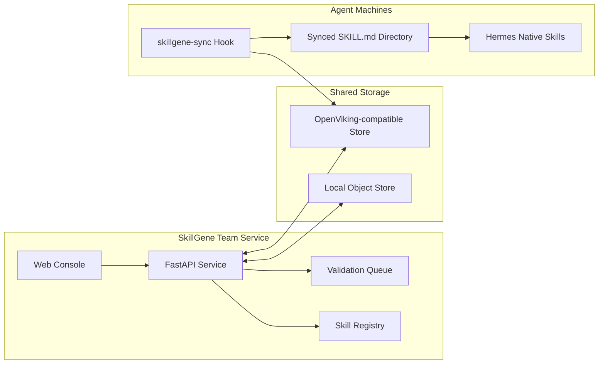
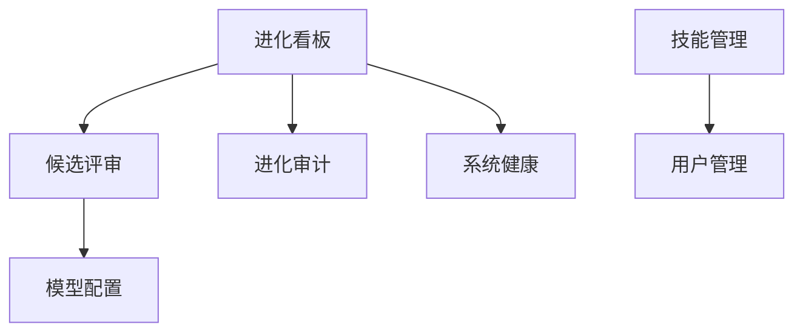
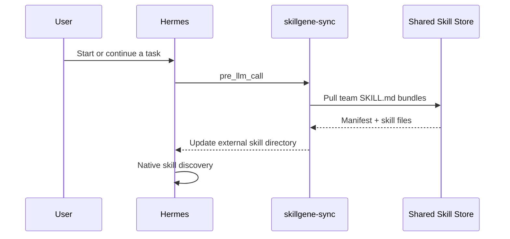
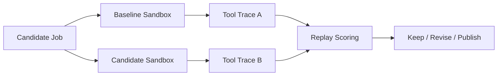

# SkillGene

<div align="center">

## 面向 Agent 团队的技能库、同步控制台与验证工作台

[](https://www.python.org/)
[](https://fastapi.tiangolo.com/)
[](https://react.dev/)
[](./LICENSE)
[](./README.en.md)

**把真实 Agent 使用经验沉淀为可复用、可同步、可验证的 `SKILL.md` 团队资产。**

</div>

---

## 为什么需要 SkillGene？

Agent 已经能完成复杂任务，但团队技能通常还停留在“某台机器上的一组文件”：

- **技能难共享**：同一条经验在不同成员、不同机器、不同 Agent 里反复复制。
- **资产难分层**：个人偏好、客户事实、团队 SOP 容易混在一起，带来隐私和污染风险。
- **版本难追踪**：技能来源、发布人、版本状态和当前团队空间内容，很难持续对齐。
- **质量难判断**：一个技能看起来写得很好，但是否真的改善任务结果，缺少证据。

**SkillGene 不是让 Agent 记住更多信息，而是建立从真实 session 到团队能力的安全流水线。**
它把分散会话转成可比较的 evidence，区分个人与团队资产，再用回放验证和版本治理发布团队技能。

---

## 设计原则

- **中心化采集**：保留 session、工具调用、成功策略和失败原因，让系统看见跨人共性。
- **分层沉淀**：先判断是否可共享，再判断应写成 `skill` 还是 `memory`；个人资产隔离，团队资产受控发布。
- **验证发布**：团队 `SKILL.md` 必须经过聚合、脱敏、去重、回放验证、版本化和回滚门控。

Hermes 等 Agent 保持原生运行方式；SkillGene 通过同步目录和 Hook 把团队技能带到 Agent 原生技能系统里。

---

## 核心能力

<table>
  <tr>
    <td width="25%" valign="top">
      <h3>技能库管理</h3>
      <p>读取、创建、编辑、删除、打包和导入标准 <code>SKILL.md</code> 技能，保留 frontmatter 与附件目录。</p>
    </td>
    <td width="25%" valign="top">
      <h3>团队同步</h3>
      <p>支持本地对象存储和 OpenViking 兼容对象存储，可区分个人空间与团队空间。</p>
    </td>
    <td width="25%" valign="top">
      <h3>Web 控制台</h3>
      <p>内置 React + TypeScript 控制台，覆盖技能管理、用户管理、候选评审、健康检查和模型配置。</p>
    </td>
    <td width="25%" valign="top">
      <h3>真实回放</h3>
      <p>True Replay 在隔离沙盒中运行 baseline 与 candidate 分支，用真实工具轨迹评估候选技能。</p>
    </td>
  </tr>
</table>

此外，内置 **SkillMiner → LIFT** 评测链路：从领域文档挖掘 Skill 与 benchmark，把题库转换为 LIFT Suite，经登录用户人工编辑和批准后发布到外部 LIFT 工作区，并在同一控制台运行 warmup/holdout 对照评测。

---

## 系统图



SkillGene 的推荐链路是“共享存储 + 本地同步 + Agent 原生加载”。这样 `skills_list`、`skill_view`、`/skills` 等能力仍由 Agent 自己提供，SkillGene 只负责把团队技能可靠送到本机。

---

## 快速开始

### 1. 安装

```bash
git clone https://github.com/leoriczhang/skillgene.git
cd skillgene
python -m venv .venv
source .venv/bin/activate
python -m pip install -U pip
python -m pip install -e ".[all]"
```

只安装核心能力：

```bash
python -m pip install -e .
```

也可以使用安装脚本：

```bash
bash scripts/install_skillgene.sh
```

### 2. 配置本地技能库

```bash
skillgene config skills.enabled true
skillgene config skills.dir ./skills
skillgene config sharing.enabled true
skillgene config sharing.backend local
skillgene config sharing.local_root ./skillgene-store
```

### 3. 创建一个技能

```bash
mkdir -p skills/example-skill
cat > skills/example-skill/SKILL.md <<'EOF'
---
name: example-skill
description: Use when you need a minimal SkillGene example.
category: general
---

# Example Skill

Follow the project conventions and keep the answer concise.
EOF
```

### 4. 同步技能

```bash
skillgene skills push
skillgene skills list-remote
skillgene skills pull
```

### 5. 启动控制台

```bash
skillgene config service.port 52010
skillgene start --daemon --port 52010
skillgene status
```

打开：

```text
http://127.0.0.1:52010/console
```

首次启动时可初始化管理员账号。默认账号与密码均为 `admin`，建议部署后立即修改。

---

## 给 Coding Agent 的 Hermes 部署说明

这一节是给 coding agent 看的。目标是：agent 只阅读本 README，就能把一台
Hermes 机器接入中心 SkillGene，并形成“团队技能同步 + 会话回流 + 自动进化”的闭环。

### 单端口约定

SkillGene 现在统一使用一个端口：`52010`。

中心机 `http://<skillgene-host>:52010` 同时承载：

- `GET /health` / `GET /healthz`：服务健康检查。
- `GET /status`：进化服务状态、排队 session 数和注册技能数。
- `POST /ingest_session`：Hermes 会话投喂入口，由 `skillgene-feed` 调用。
- `POST /trigger`：立即触发一次 evolve cycle；只是提速信号，后台仍会周期扫描 `sessions/` 队列。
- `GET /sessions`、`GET /conversations`、`GET /validation/candidates`、`GET /storage/status`：控制台和巡检接口。
- `POST /api/mining/trajectory-benchmarks`：从 SkillGen 等 Agent 轨迹中独立挖掘 Benchmark；不触发 Skill 编译或 LIFT。
- `GET /api/mining/trajectory-benchmarks` 及 `GET /api/mining/trajectory-benchmarks/{run_id}`：查看历史任务及异步运行状态。
- `GET /console`：Web 控制台。

### 给 Agent 的输入变量

部署前先确定这些变量，不要硬编码到仓库：

```bash
export SKILLGENE_REPO="/path/to/skillgene"
export HERMES_HOME="${HERMES_HOME:-$HOME/.hermes}"
export SKILLGENE_HOST="<center-linux-intranet-ip>"
export SKILLGENE_PORT="52010"
export SKILLGENE_URL="http://${SKILLGENE_HOST}:${SKILLGENE_PORT}"
export SKILLGENE_USER="<unique-user-alias-for-this-machine>"
export SKILLGENE_API_KEY=""   # 仅当服务端设置 EVOLVE_INGEST_API_KEY 时填写
SKILLGENE_AUTH_ARGS=()
[ -n "$SKILLGENE_API_KEY" ] && SKILLGENE_AUTH_ARGS=(--api-key "$SKILLGENE_API_KEY")
```

`SKILLGENE_USER` 必须能区分不同机器或员工；它会出现在控制台“会话历史”中，也用于后续归因。

### 中心 Linux 机器部署

中心机只需要启动 SkillGene 一个服务，监听 `0.0.0.0:52010`。`skill_evolver`
`
```bash
cd "$SKILLGENE_REPO"
python -m pip install -U pip
python -m pip install -e ".[all]"
npm --prefix web-ui install
npm --prefix web-ui run build

skillgene config service.host 0.0.0.0
skillgene config service.port 52010
skillgene config sharing.enabled true
skillgene config sharing.backend viking
# 按实际团队配置写入 OpenViking 参数；不要把真实 key 提交进仓库。
# skillgene config sharing.viking_team_api_key "<team-key>"
# skillgene config sharing.viking_personal_api_key "<personal-key>"
# skillgene config sharing.viking_root_prefix "team-skill-evolver"

skillgene stop || true
skillgene start --daemon --port 52010
```

> **关于 Hermes CLI：** 进化（evolve）链路直连 LLM HTTP API，**不需要** Hermes。
> 但文档挖掘（SkillMiner）流水线是通过 subprocess 调用本机 `hermes` 二进制来跑模型的，
> 所以**中心机若要支持挖掘，必须装 Hermes CLI**。推荐用 `scripts/install_skillgene.sh`
> 部署——它会在 pip 安装后**幂等地**探测并按需安装 Hermes（已安装则跳过）：
>
> ```bash
> bash scripts/install_skillgene.sh                 # 自动装 SkillGene + Hermes CLI
> bash scripts/install_skillgene.sh --skip-hermes   # 仅进化，不装 Hermes（挖掘不可用）
> # 离线/内网镜像：export HERMES_INSTALL_URL=<你的镜像 install.sh>
> ```
>
> 若手动 pip 安装（如上），挖掘要能用需另行安装 Hermes：
> `curl -fsSL https://hermes-agent.nousresearch.com/install.sh | bash -s -- --skip-setup --non-interactive`，
> 装完确保 `~/.local/bin` 在 PATH 上，`hermes --version` 可用。

中心机验证：

```bash
ss -ltnp | grep 52010
curl -fsS "$SKILLGENE_URL/health"
curl -fsS "$SKILLGENE_URL/status"
curl -fsS -X POST "$SKILLGENE_URL/trigger"
hermes --version   # 仅当需要文档挖掘时；进化不依赖它
```


### Hermes 机器接入

Hermes 机器不要配置 OpenViking team key。推荐全部走 SkillGene 服务后端：
本机只知道 `SKILLGENE_URL` 和 `SKILLGENE_USER`，底层 OpenViking endpoint/key/root prefix
留在中心 SkillGene 服务里。

1. 安装团队技能同步 hook：`skillgene-sync`

```bash
python "$SKILLGENE_REPO/skillgene/integrations/hermes_skill_sync/install.py" \
  --hermes-home "$HERMES_HOME" \
  --backend service \
  --url "$SKILLGENE_URL" \
  --user "$SKILLGENE_USER" \
  "${SKILLGENE_AUTH_ARGS[@]}"
```

该脚本会：

- 复制 `skillgene-sync` 到 `$HERMES_HOME/skills/skillgene-sync/`。
- 写入 `$HERMES_HOME/skills/skillgene-sync/sync.json`。
- 把 `$HERMES_HOME/team_skills/skillgene` 加入 Hermes `skills.external_dirs`。
- 注册 `pre_llm_call` hook，在每次模型调用前拉取团队技能。
- 写入 scoped hook allowlist approval，避免首次运行被 TTY 授权卡住。

2. 安装会话回流 hook：`skillgene-feed`

```bash
python "$SKILLGENE_REPO/skillgene/integrations/hermes_skill/install.py" \
  --hermes-home "$HERMES_HOME" \
  --user "$SKILLGENE_USER" \
  --url "$SKILLGENE_URL" \
  "${SKILLGENE_AUTH_ARGS[@]}"
```

该脚本会：

- 复制 `skillgene-feed` 到 `$HERMES_HOME/skills/skillgene-feed/`。
- 写入 `$HERMES_HOME/skills/skillgene-feed/feed.json`。
- 注册 `on_session_end` hook，在每次 Hermes 会话结束后 POST `/ingest_session`。
- 上传字段包括 `injected_skills`、`used_skills`、tool calls、tool results 和 token metrics。

3. 立即验证同步和 hook

```bash
python "$HERMES_HOME/skills/skillgene-sync/sync_skills.py"
hermes hooks list
hermes hooks test pre_llm_call
hermes hooks test on_session_end
```

`on_session_end` 的 synthetic test 如果输出 skipped 是正常的；它没有真实 Hermes session
正文可上传。真实验证方式是让 Hermes 完成一轮普通对话，然后看 SkillGene 控制台
“会话历史”是否出现 `SKILLGENE_USER`。

如果 Hermes 已经在运行，在 Hermes 会话内执行：

```text
/reload-skills
```

新会话会自动读取同步后的团队技能。

### 接入成功判据

coding agent 必须逐项确认：

```bash
curl -fsS "$SKILLGENE_URL/status"
curl -fsS -X POST "$SKILLGENE_URL/trigger"
test -f "$HERMES_HOME/skills/skillgene-sync/sync.json"
test -f "$HERMES_HOME/skills/skillgene-feed/feed.json"
test -d "$HERMES_HOME/team_skills/skillgene"
hermes hooks list
```

成功状态：

- `status.running == true`。
- `POST /trigger` 返回 JSON，不是 nginx 403/404。
- `sync.json.base_url` 和 `feed.json.base_url` 都是 `http://<skillgene-host>:52010`。
- `skills.external_dirs` 包含 `$HERMES_HOME/team_skills/skillgene`。
- hook allowlist 中有 `skillgene-sync` 和 `skillgene-feed` 对应命令。

### 常见问题

- 如果 `POST /trigger` 返回 nginx 默认 `403`，先确认没有走 HTTP 代理：

  ```bash
  curl --noproxy '*' -v "$SKILLGENE_URL/status"
  curl --noproxy '*' -v -X POST "$SKILLGENE_URL/trigger"
  export NO_PROXY="${SKILLGENE_HOST},10.0.0.0/8,127.0.0.1,localhost"
  ```

- 如果 `52010/trigger` 返回 404，说明中心服务不是当前单端口版，或没有重启到最新代码。
- 如果 `52010/ingest_session` 返回 `session_id is required`，说明服务可达；这是空 body 的预期校验错误。
- 如果同步不到技能，先查 `/storage/status`，再查中心机 OpenViking 配置。
- 不要把 OpenViking team key 分发到每台 Hermes 机器；默认使用 `--backend service`。

---

## 控制台概览

<div align="center">
  
  <br>
  <sub>SkillGene 控制台：进化看板、团队技能状态、存储连通性与管理入口。</sub>
</div>



控制台内置以下页面：

- **进化看板**：查看存储连通性、技能数量、候选队列和系统状态。
- **候选评审**：检查待验证候选技能，配合 True Replay 做发布前评估。
- **进化审计**：查看技能演进相关记录。
- **系统健康**：检查服务、存储和关键 API 是否可达。
- **技能管理**：管理个人技能与团队技能，支持上传 zip 包。
- **用户管理**：管理用户、角色，以及个人/团队空间凭据。
- **模型配置**：配置可选验证模型，并提供连通性测试。
- **文档挖掘**：运行 SkillMiner 的样本包构建、语义发现、技能编译、Benchmark 与覆盖报告，并提供从 Agent 轨迹独立挖掘 Benchmark 的 API。
- **评测中心**：编辑 SkillMiner 转换出的 LIFT 草稿，完成结构校验、人工审核、发布与运行。

### 接入 LIFT 评测框架

LIFT 作为单独的外部工作区接入，不会被复制进 SkillGene 安装包：

```bash
bash scripts/setup_lift.sh
# 完整运行前，再按 LIFT 文档准备 Python 3.12、Docker、Langfuse、凭据和 runtime 镜像
```

生成 SkillMiner benchmark 后，控制台“评测中心”会显示自动创建的待审核 LIFT 草稿。只有保存且结构校验通过的草稿才能人工批准，只有已批准草稿才能发布到 `<LIFT>/assets/benchmarks/skillgene/`。详细的数据映射、环境变量和目录说明见 [SkillMiner LIFT 集成文档](./skillgene/skillminer/README.md#lift-集成与人工审核)。

> 当前适配基于 LIFT revision `ed8c9d750d729e4c5b1bbf237dd8483d9d142689`。上游仓库目前未提供许可证文件，因此 SkillGene 只提供兼容适配与 setup 脚本；部署或再分发前请确认上游授权条件。

---

## 团队技能同步

推荐在 Agent 机器上安装 `skillgene-sync`，在每次任务执行前拉取团队技能，并把同步目录加入 Agent 的外部技能目录。



安装示例：

```bash
python skillgene/integrations/hermes_skill_sync/install.py \
  --url "http://<skillgene-host>:52010" \
  --user "<skillgene-user>"
```

默认安装走 SkillGene 服务后端。本地 Hermes 只需要知道 SkillGene 服务地址和
SkillGene 用户名；OpenViking endpoint、团队 key、root prefix 等共享存储配置
只保存在云端 SkillGene 服务里，避免每台机器重复配置或配错。

安装脚本会写入类似配置：

```yaml
skills:
  external_dirs:
    - <HERMES_HOME>/team_skills/skillgene
hooks:
  pre_llm_call:
    - command: "python3 <HERMES_HOME>/skills/skillgene-sync/sync_skills.py"
      timeout: 60
```

对应的 `sync.json` 类似：

```json
{
  "backend": "service",
  "base_url": "http://<skillgene-host>:52010",
  "user_alias": "<skillgene-user>",
  "target_dir": "<HERMES_HOME>/team_skills/skillgene"
}
```

如果 Agent 已经在运行，执行 `/reload-skills` 刷新当前会话缓存；新会话会自动读取同步后的技能。

### 会话技能归因与效率指标

`skillgene-feed` 的 `on_session_end` hook 会从 Hermes `state.db` 上传完整轨迹，
完整保留 system、user、assistant、tool 消息，以及工具调用和工具结果：

- `injected_skills`：system prompt 的 `<available_skills>` 中实际暴露的技能。
- `used_skills`：本次对话实际通过 `skill_view` 加载的技能。
- `metrics`：交互轮次、工具调用次数，以及 input/output/cache/reasoning tokens。

安装 `skillgene-feed` 后，这些字段会随 `/ingest_session` 一起进入会话归档和控制台详情。

---

## OpenViking / 对象存储

远端同步通过对象存储抽象完成。默认 endpoint 使用火山托管 OpenViking：

```bash
skillgene config sharing.enabled true
skillgene config sharing.backend viking
skillgene config sharing.viking_team_api_key "<team-key>"
skillgene config sharing.viking_personal_api_key "<personal-key>"
skillgene config sharing.viking_root_prefix "skillgene"
```

如果需要自部署 OpenViking Server，请参考 [volcengine/OpenViking](https://github.com/volcengine/OpenViking)，并通过 `skillgene config sharing.viking_endpoint "<your-server-url>"` 覆盖默认服务地址。

不要把真实 API Key 写入仓库。建议使用本机配置、环境变量或部署系统的 Secret 管理能力注入。

---

## True Replay：用真实轨迹验证技能

普通文本 A/B 只能判断回答像不像；True Replay 会在隔离环境中启动真实 Agent，对 baseline 和 candidate 两个分支分别执行任务。任务未完成时，裁判反馈会作为下一轮用户消息在同一 session 中继续交互。最终优先比较：

1. 达成任务所需的交互轮次，越少越好。
2. 工具调用次数，越少通常说明执行路径越直接。
3. Total tokens，并同时保留 input/output/cache/reasoning token 明细。



安装依赖：

```bash
python -m pip install -e ".[truereplay]"
```

从验证队列回放：

```bash
python -m skillgene.true_replay --job-id <validation-job-id> --json
```

使用本地 JSON 文件独立回放：

```bash
python -m skillgene.true_replay --job-file ./candidate_job.json --dry-run
python -m skillgene.true_replay --job-file ./candidate_job.json --json
```

True Replay 会为两条分支创建临时 `HOME` 与 `HERMES_HOME`，不会修改真实 Agent 配置。若使用本地 Agent checkout，可通过 `HERMES_ORIGIN` 指定源码位置。

---

## 项目结构

```text
skillgene/
├── skillgene/
│   ├── cli/              # skillgene 命令行
│   ├── config_store/     # 本地配置读写
│   ├── proxy/            # 服务路由、控制台与管理接口
│   ├── skills/           # SKILL.md 管理、打包、同步
│   ├── storage/          # local / OpenViking 存储后端
│   ├── integrations/     # Hermes 集成
│   ├── validation/       # 可选候选技能验证
│   ├── true_replay.py    # 真实 A/B 回放
│   └── web/              # 控制台构建产物
├── web-ui/               # React + TypeScript 控制台源码
├── tests/
├── scripts/
└── pyproject.toml
```

---

## 开发

```bash
python -m pip install -e ".[dev,all]"
python -m pytest
```

构建前端与 Python 包：

```bash
npm --prefix web-ui install
npm --prefix web-ui run build
python -m pip install build
python -m build
```

---

## 参考与引用

相关项目与资料：
- [SkillClaw](https://github.com/AMAP-ML/SkillClaw)：多 Angent skills 进化项目。
- [OpenSpace](https://github.com/HKUDS/OpenSpace)：质量优先的 Agent Skill Hub。
- [Hermes Agent](https://github.com/nousresearch/hermes-agent)：可选 True Replay 运行时依赖。
- [FastAPI](https://fastapi.tiangolo.com/)：SkillGene 服务端框架。
- [React](https://react.dev/) 与 [TypeScript](https://www.typescriptlang.org/)：SkillGene 控制台技术栈。

---

## License

MIT
