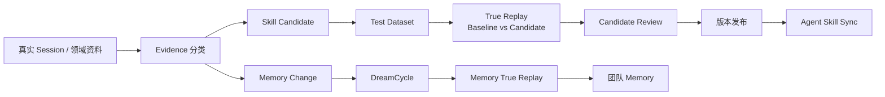
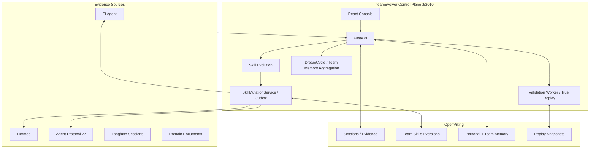

# teamEvolver

<div align="center">

### Agent 团队能力进化控制面

[](https://www.python.org/)
[](https://fastapi.tiangolo.com/)
[](https://react.dev/)
[](https://github.com/volcengine/OpenViking)
[](./LICENSE)
[](./README.en.md)

**把真实 Agent Session 转化为可复用、可验证、可治理的团队 Skill 与团队 Memory。**

</div>

---

## 产品定位

新增的默认关闭实验模块 `team_ontology` 提供 Ontology 构建、审核与发布工作台；正式本体资产与读取由 OpenViking 承担。
Wiki 目录、单文件与上传资料通过原生 OV Compile 生成 Schema 和事实草稿，TE 确认 Schema、校验证据并评审发布。操作、配置与未验证边界见 [V6 原生 Compile 指南](docs/ontology-integration/45-native-compile-wiki-operations.md)
与 [可离线阅读的 HTML 工程说明](docs/reports/02-ontology-integration-explained.html)。

teamEvolver 位于 Agent 运行时之外，负责团队能力的持续进化与治理。它接收真实 Session 和领域资料，提取可追溯 Evidence，生成 Skill Candidate 或 Memory Change，再经过静态检查、True Replay、按需人工门禁、版本发布和受控分发形成闭环。

它不是另一个 Agent Runtime，也不是文件同步脚本：

- Agent 继续使用自己的模型、工具、工作区和执行循环。
- teamEvolver 统一负责 Evidence、进化、验证、版本、审计和发布。
- OpenViking 是团队 Skill、Memory、Session 和快照的上下文存储。
- Langfuse 可独立承担 Session 拉取与进化链路观测。

## 进化闭环



Checklist 是完成门禁，不是加权分数。通过门禁后，True Replay 按交互轮次、工具调用数、Token 用量依次比较效率。

## 核心能力

| 模块 | 当前能力 |
| --- | --- |
| Session 与 Evidence | V1 Session ingest、Langfuse 拉取、价值分类、近期/历史 Evidence 窗口、过滤审计 |
| Skill Evolution | 总结、裁判、分组、改进/新建/冲突合并、同源 Test Dataset 生成 |
| True Replay | 在真实 Agent Runtime 中并行运行 Baseline/Candidate，校验 Checklist、轨迹、产物和效率 |
| Candidate Governance | 候选评审、强制/按回放发布、版本详情、完整 Bundle Diff、回滚与审计 |
| Memory Evolution | DreamCycle 维护、跨 User 团队记忆聚合、可编辑聚合 Skill、增量编译及 Memory Replay |
| 实验工作台 | 编辑 Skill Bundle，并用数据集对未保存的多文件 Candidate 执行 True Replay |
| 个人与团队资产 | 分别从 `viking://user` 和 `viking://resources` 浏览、编辑 OpenViking 资产 |
| SkillMiner | 从文档知识源生成 Skill、语义报告、`EVALUATION.md` 和内部 Benchmark |
| Agent Protocol v2 | 租户主体、Context、Session ingest、ReplayAdapterFactory、Skill pull |
| Observability | Langfuse Session 导入，以及模型、工具、Skill Evolution、DreamCycle 全链路追踪 |

所有团队 Skill 变更统一经过 `SkillMutationService`，由提交记录、tombstone、持久化 outbox 和 Agent 分发状态共同保证一致性。

## 控制台

### 运行总览

完整展示 Session 队列与历史、待发布候选、回放结论和 Skill 版本。

<a href="./docs/assets/teamEvolver-console-dashboard.png">
  
</a>

### 白盒进化链路

完整展示 Skill Evolution 阶段、8 个可编辑 Prompt、模型参数、过程参数和真实输入/输出测试。

<a href="./docs/assets/teamEvolver-evolution-pipeline.png">
  
</a>

## 系统架构



控制台、进化引擎、验证队列、DreamCycle、SkillMiner 和 Agent 集成共享同一个 FastAPI 服务与配置源。

## 快速开始

要求：Python 3.10+。完整安装会在项目虚拟环境内安装文档挖掘和 True Replay 所需的 Hermes。

```bash
git clone https://github.com/leoriczhang/teamEvolver.git
cd teamEvolver

python3 -m venv .venv
source .venv/bin/activate
python -m pip install -U pip
python -m pip install -e ".[all]"

teamEvolver config service.port 52010
teamEvolver start --daemon
teamEvolver status
```

打开 `http://127.0.0.1:52010/`。首次访问会直接进入管理员初始化页，默认表单值为 `admin`，请在生产环境改用强密码。登录后按以下顺序配置：

1. **全局模型**：OpenAI-compatible Base URL、Model 与 API Key。
2. **运行状态 → OpenViking 部署**：选择火山云或自建服务；远程自建实例通过 Endpoint 覆盖填写，例如 `http://10.0.0.8:1933`。
3. **用户与权限**：配置控制台用户、角色和个人记忆/团队资源的 Account + Name 绑定；Trusted 模式统一使用服务端 Root Key。
4. **Agent Integration**：配置租户 Key 与 user_id；需要 True Replay 时绑定运行环境。
5. **Langfuse 接入**：按需启用 Session 拉取、出站链路追踪或自定义 Trace 映射。

控制台当前按五个区域组织：

| 区域 | 主要入口 |
| --- | --- |
| 技能挖掘 | 挖掘总览、知识源、挖掘任务 |
| 进化闭环 | 运行总览、候选评审、进化审计、过滤审计、Langfuse、Skills/团队 Memory 自进化 |
| 资产中心 | 实验工作台、个人与团队资产、平台资产 |
| 平台治理 | 全局模型、用户与权限、运行状态 |
| 文档 | 内置双语文档阅读与搜索 |

常用命令：

```bash
teamEvolver status
teamEvolver doctor
teamEvolver config show
teamEvolver stop
```

源码已包含构建后的控制台；只有修改 `web-ui/` 时才需要执行前端构建。

也可以直接使用 Docker Compose。镜像会构建控制台、安装完整 Python 依赖并捆绑 OpenViking CLI，运行数据保存在仓库的 `runtime/` 目录：

```bash
docker compose up -d --build
docker compose ps
```

## Agent 接入

使用 [v2 协议](./docs/zh/agent-integrations/06-protocol-v2.md)：服务地址、租户 Key 与 user_id 即可接入。
Context 和 Session 归属固定为 tenant/user；Account 由租户有效配置解析。
Skill 通过认证 pull 获取，True Replay 通过租户绑定的 ReplayAdapterFactory 创建独立会话。
OpenViking Root Key 与模型 Key 保留在服务端。
旧部署按 [分阶段迁移](./docs/zh/guides/11-agent-deregistration.md) 升级；数据迁移与最终清理分别发布。

## 安全与一致性

- Replay 只物化必要的 Runtime 配置，不复制完整生产数据库。
- Candidate 进程不直接持有上游模型密钥；模型访问通过短期 Broker。
- 网络副作用默认 fail-closed；无法确定性重放的外部工具不会回退到真实调用。
- Context 引用由服务端签发并校验 Tenant、User、Session 和过期时间。
- 团队 Memory 与团队 Skill 对普通 Agent 只读；个人 Memory 写入受 tenant/user 归属约束。
- Skill 发布、回滚、删除和同步使用统一 mutation 流程；pull 模式保留版本和 tombstone。
- Langfuse 上报 fail-open，不阻塞进化和 Memory 维护。

## 项目结构

```text
teamEvolver/
├── teamEvolver/
│   ├── evolve/          # Evidence、Skill Evolution、Dataset、发布
│   ├── replay.py        # team_replay 虚拟兼容入口
│   ├── validation/      # Candidate 队列、结果存储与 Validation Worker
│   ├── aggregation/     # 跨 User 团队记忆聚合与增量状态
│   ├── integrations/    # 租户主体、Context、协议与 Skill pull
│   ├── proxy/           # FastAPI、控制台与 Workspace 接口
│   ├── config_store/    # YAML 配置默认值、持久化与运行时桥接
│   ├── skills/          # Bundle、版本与 SkillMutationService
│   └── storage/         # OpenViking 存储适配
├── session_ingestion/   # Session Push、Pull、共享接入管线与数据源 Adapter
├── team_miner/          # Skill 挖掘、Benchmark、任务编排与主服务桥接
├── team_memory/         # Memory 聚合、维护、账本与路由
├── team_replay/         # True Replay Interface、引擎、策略与 Runtime Adapter
├── web-ui/              # React + TypeScript 控制台源码
├── tests/               # 单元、集成、协议和回放测试
└── docs/                # Markdown 文档源（中/英双语，控制台内可阅读和搜索）
```

## 文档

文档以 Markdown 源文件维护在 `docs/` 目录下，提供中/英双语版本。登录控制台后，左侧导航栏"文档 → 使用文档"内置阅读器支持目录树浏览、全文搜索、中英文切换与 Markdown/GFM/代码块/表格渲染：

| 章节 | 内容 |
| --- | --- |
| 开始使用 | [产品简介](./docs/zh/getting-started/01-introduction.md)、[快速开始](./docs/zh/getting-started/02-quickstart.md)、[安装部署](./docs/zh/getting-started/03-installation.md) |
| 核心概念 | [架构总览](./docs/zh/concepts/01-architecture.md)、[进化闭环](./docs/zh/concepts/02-evolution-loop.md)、[Skill 体系](./docs/zh/concepts/03-skills.md)、[Memory & DreamCycle](./docs/zh/concepts/04-memory.md)、[True Replay](./docs/zh/concepts/06-true-replay.md) |
| 使用指南 | [配置参考](./docs/zh/guides/01-configuration.md)、[生产部署](./docs/zh/guides/02-deployment.md)、[Web 控制台](./docs/zh/guides/03-console.md)、[可观测性](./docs/zh/guides/04-observability.md)、[故障排查](./docs/zh/guides/06-troubleshooting.md) |
| Agent 接入 | [接入概览](./docs/zh/agent-integrations/01-overview.md)、[Protocol v2 规范](./docs/zh/agent-integrations/06-protocol-v2.md)、[Hermes 接入](./docs/zh/agent-integrations/03-hermes.md)、[自定义接入](./docs/zh/agent-integrations/05-custom-agent.md) |
| API 参考 | [API 概览](./docs/zh/api/01-overview.md)、[Agent 注册](./docs/zh/api/02-agent-register.md)、[Session 上报](./docs/zh/api/03-session-ingest.md)、[Context Workspace](./docs/zh/api/04-context-workspace.md)、[Skill 管理](./docs/zh/api/09-skills-admin.md)、[团队记忆聚合](./docs/zh/api/11-team-memory-aggregation.md) |
| 设计文档 | [Master PRD](./docs/design/01-master-prd.md)、[DreamCycle 评估](./docs/design/02-dreamcycle-snapshot-evaluation.md)、[OpenViking 能力调研](./docs/design/03-openviking-capabilities.md) |

### 文档同步约定

修改代码后需同步更新文档时，请遵循 [文档维护指南](./docs/zh/api/99-docs-maintenance.md)。提交前运行 `node docs/scripts/check-docs-refs.mjs` 验证所有代码引用和链接有效。

- [Protocol JSON Schemas](./docs/schemas/)
- [English Documentation](./docs/en/getting-started/01-introduction.md)

## 开发验证

```bash
python -m pip install -e ".[all,dev]"
npm --prefix web-ui ci
bash scripts/verify_local.sh
```

`verify_local.sh` 会执行 Python 编译、测试套件和前端生产构建。

## License

[MIT](./LICENSE)

Ontology 发布复用 trusted + Root Key，保留人工审批，不再配置发布公私钥。见 [发布与升级说明](docs/ontology-integration/38-trusted-root-publication.md)。

## 服务日志

前台与后台均支持控制台和文件双输出、按天／大小轮转及目录配置。管理员在「运行状态」查看当前日志位置和降级状态，部署与排障步骤见 [服务日志与 Ontology 排障](docs/zh/guides/15-service-logging.md)。
