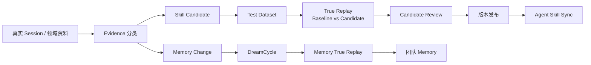
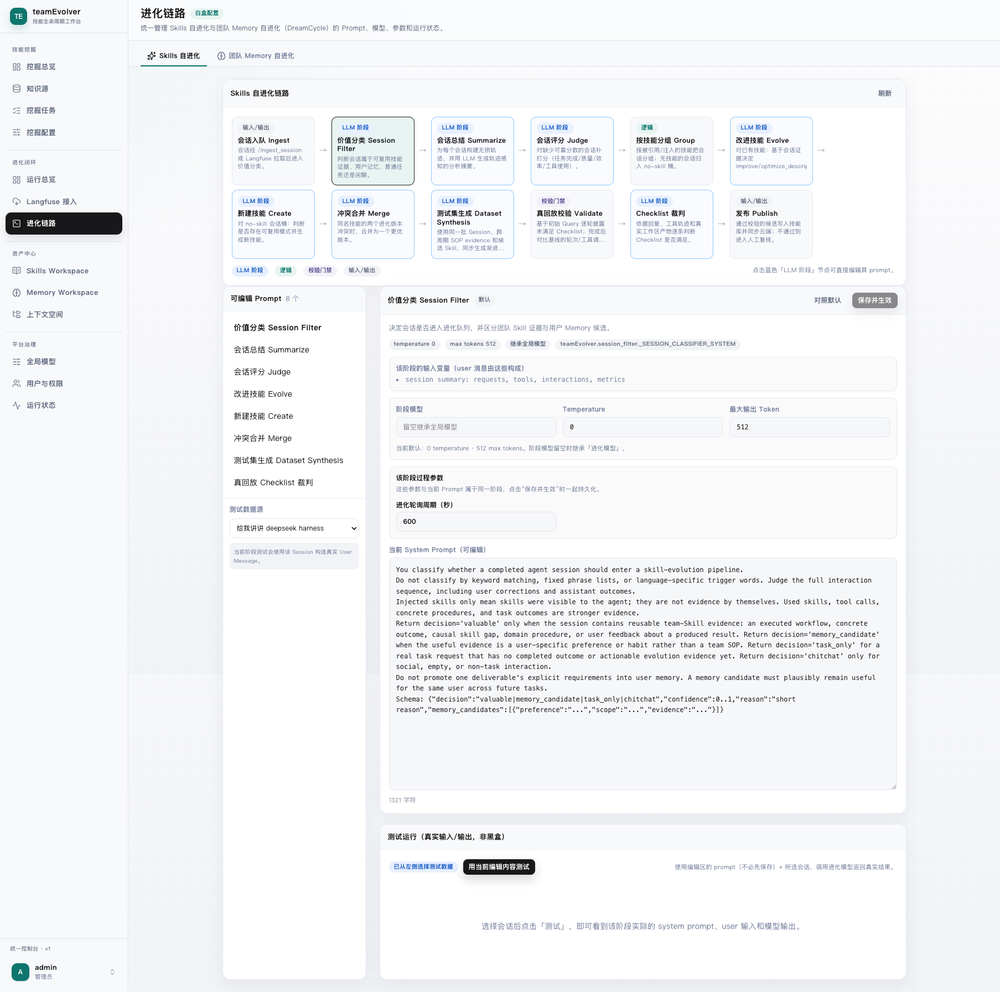
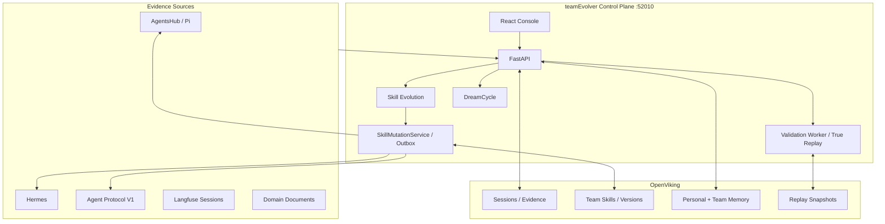

# teamEvolver

<div align="center">

### Agent 团队能力进化控制面

[](https://www.python.org/)
[](https://fastapi.tiangolo.com/)
[](https://react.dev/)
[](https://github.com/volcengine/OpenViking)
[](./LICENSE)
[](./README.en.md)

**把真实 Agent Session 转化为可复用、可验证、可治理的团队 Skill 与团队 Memory。**

</div>

---

## 产品定位

teamEvolver 位于 Agent 运行时之外，负责团队能力的持续进化与治理。它接收真实 Session 和领域资料，提取可追溯 Evidence，生成 Skill Candidate 或 Memory Change，再经过静态检查、True Replay、人工门禁、版本发布和受控分发形成闭环。

它不是另一个 Agent Runtime，也不是文件同步脚本：

- Agent 继续使用自己的模型、工具、工作区和执行循环。
- teamEvolver 统一负责 Evidence、进化、验证、版本、审计和发布。
- OpenViking 是团队 Skill、Memory、Session 和快照的上下文存储。
- Langfuse 可独立承担 Session 拉取与进化链路观测。

## 进化闭环



Checklist 是完成门禁，不是加权分数。通过门禁后，True Replay 按交互轮次、工具调用数、Token 用量依次比较效率。

## 核心能力

| 模块 | 当前能力 |
| --- | --- |
| Session 与 Evidence | V1 Session ingest、Langfuse 拉取、价值分类、近期/历史 Evidence 窗口、过滤审计 |
| Skill Evolution | 总结、裁判、分组、改进/新建/冲突合并、同源 Test Dataset 生成 |
| True Replay | 在真实 Agent Runtime 中并行运行 Baseline/Candidate，校验 Checklist、轨迹、产物和效率 |
| Candidate Governance | 候选评审、强制/按回放发布、版本详情、完整 Bundle Diff、回滚与审计 |
| Memory Evolution | DreamCycle 团队概况、去重、清理、新人可发现性、个人经验团队化及 Memory Replay |
| Skill Workspace | `SKILL.md` 与多文件 Bundle 的创建、编辑、导入、版本管理和 Skill Lab |
| Context Workspace | 个人/团队 Memory 与 Skill 的检索、分级读取、引用回执和使用归因 |
| SkillMiner | 从文档知识源生成 Skill、语义报告、`EVALUATION.md` 和内部 Benchmark |
| Agent Protocol V1 | 注册、身份映射、Context、Session ingest、Replay Branch、Skill Sync |
| Observability | Langfuse Session 导入，以及模型、工具、Skill Evolution、DreamCycle 全链路追踪 |

所有团队 Skill 变更统一经过 `SkillMutationService`，由提交记录、tombstone、持久化 outbox 和 Agent 分发状态共同保证一致性。

## 控制台

### 运行总览

完整展示 Session 队列与历史、待发布候选、回放结论和 Skill 版本。

<a href="./docs/assets/teamEvolver-console-dashboard.png">
  
</a>

### 白盒进化链路

完整展示 Skill Evolution 阶段、8 个可编辑 Prompt、模型参数、过程参数和真实输入/输出测试。

<a href="./docs/assets/teamEvolver-evolution-pipeline.png">
  
</a>

## 系统架构



控制台、进化引擎、验证队列、DreamCycle、SkillMiner 和 Agent 集成共享同一个 FastAPI 服务与配置源。

## 快速开始

要求：Python 3.10+。完整安装会在项目虚拟环境内安装文档挖掘和 True Replay 所需的 Hermes。

```bash
git clone https://github.com/leoriczhang/teamEvolver.git
cd teamEvolver

python3 -m venv .venv
source .venv/bin/activate
python -m pip install -U pip
python -m pip install -e ".[all]"

teamEvolver config service.port 52010
teamEvolver start --daemon
teamEvolver status
```

打开 `http://127.0.0.1:52010/`。首次访问创建管理员，然后在控制台配置：

1. **全局模型**：OpenAI-compatible Base URL、Model 与 API Key。
2. **OpenViking**：选择本地或云端部署，配置个人空间与团队空间。
3. **Agent Integration**：注册 Runtime，映射外部 Subject，启用 Session、Context、Replay 和 Skill Sync。
4. **Langfuse**：按需启用 Session 拉取或链路追踪，两者可独立开关。

常用命令：

```bash
teamEvolver status
teamEvolver doctor
teamEvolver config show
teamEvolver stop
```

源码已包含构建后的控制台；只有修改 `web-ui/` 时才需要执行前端构建。

## Agent 接入

推荐使用 [Agent Integration Protocol V1](./docs/agent-integration-protocol-v1.md)：

| Capability | Agent 需要提供 |
| --- | --- |
| `session.ingest.v1` | 完整 Session、工具轨迹、Token、Skill 使用和 Context 引用 |
| `context.workspace.v1` | 通过短期 `context_ref` 解析和读取个人/团队 Context |
| `replay.branch.v1` | 同步执行一个隔离的 Baseline 或 Candidate Branch |
| `skill.sync.v1` | 接收已发布 Bundle，并按版本与 SHA-256 校验落地 |

V1 Token 标识 Integration，不冒充用户。每个请求使用稳定的 `external_subject`，由管理员配置：

```text
integration_id + external_subject -> teamEvolver user
```

OpenViking Key、模型 Key 和团队 Memory 写权限始终保留在 teamEvolver 服务端。

## 安全与一致性

- Replay 只物化必要的 Runtime 配置，不复制完整生产数据库。
- Candidate 进程不直接持有上游模型密钥；模型访问通过短期 Broker。
- 网络副作用默认 fail-closed；无法确定性重放的外部工具不会回退到真实调用。
- Context 引用由服务端签发并校验 Integration、Subject、Session 和过期时间。
- 团队 Memory 与团队 Skill 对普通 Agent 只读；个人 Memory 写入受 Subject 映射约束。
- Skill 发布、回滚、删除和同步使用统一 mutation 流程与持久化 outbox。
- Langfuse 上报 fail-open，不阻塞进化和 Memory 维护。

## 项目结构

```text
teamEvolver/
├── teamEvolver/
│   ├── evolve/          # Evidence、Skill Evolution、Dataset、发布
│   ├── validation/      # Candidate 队列与 True Replay Worker
│   ├── dreamcycle/      # 团队 Memory 进化与 Memory Replay
│   ├── integrations/    # Agent V1、Hermes、Langfuse、Replay Adapter
│   ├── proxy/           # FastAPI、控制台与 Workspace 接口
│   ├── skillminer/      # 文档技能挖掘
│   ├── skills/          # Bundle、版本与 SkillMutationService
│   └── storage/         # OpenViking 存储适配
├── web-ui/              # React + TypeScript 控制台源码
├── tests/               # 单元、集成、协议和回放测试
└── docs/                # 协议、Schema、PRD 与专题文档
```

## 文档

| 文档 | 内容 |
| --- | --- |
| [Agent Integration Protocol V1](./docs/agent-integration-protocol-v1.md) | 注册、鉴权、Context、Session、Replay 和 Skill Sync 契约 |
| [Protocol Schemas](./docs/schemas/) | V1 JSON Schema |
| [Coding Agent 接入](./docs/coding-agent.md) | Coding Agent / Hermes 侧安装与同步 |
| [Master PRD](./docs/prd/team-evolver-master-prd.md) | 产品范围、角色和验收标准 |
| [Loop Engineering](./docs/loop-engineering-teamevolver.html) | 完整进化闭环说明 |
| [OpenViking 调研](./docs/research/openviking-product-capabilities-beyond-compile-snapshot.md) | Context 与 Snapshot 能力评估 |

## 开发验证

```bash
python -m pip install -e ".[all,dev]"
npm --prefix web-ui ci
bash scripts/verify_local.sh
```

`verify_local.sh` 会执行 Python 编译、测试套件和前端生产构建。

## License

[MIT](./LICENSE)
