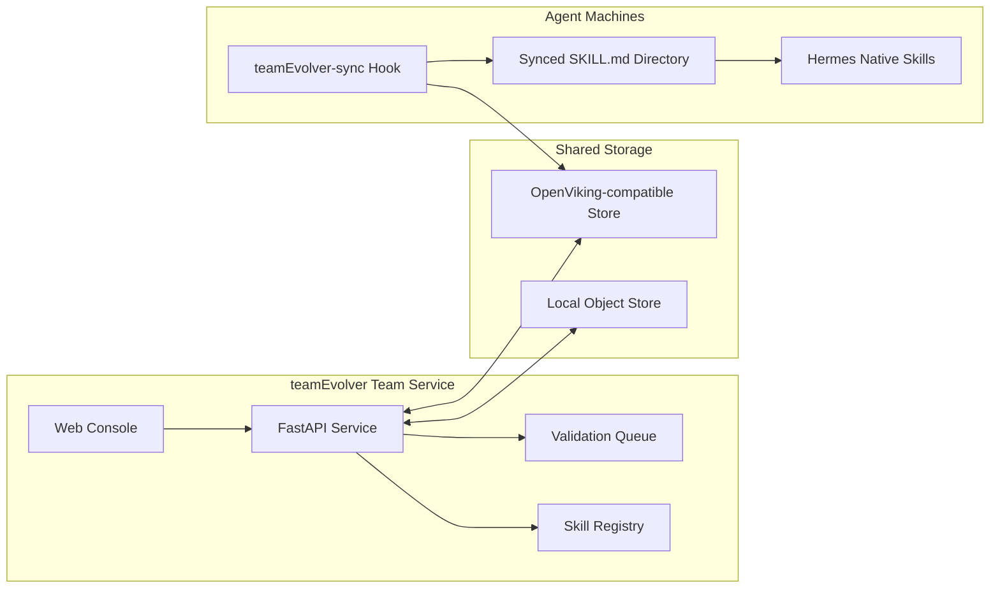
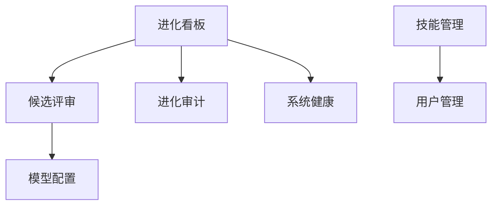
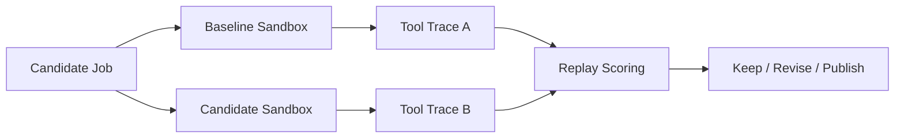

# teamEvolver

<div align="center">

## 面向 Agent 团队的技能库、同步控制台与验证工作台

[](https://www.python.org/)
[](https://fastapi.tiangolo.com/)
[](https://react.dev/)
[](./LICENSE)
[](./README.en.md)

**把真实 Agent 使用经验沉淀为可复用、可同步、可验证的 `SKILL.md` 团队资产。**

</div>

---

## 为什么需要 teamEvolver？

Agent 已经能完成复杂任务，但团队技能通常还停留在“某台机器上的一组文件”：

- **技能难共享**：同一条经验在不同成员、不同机器、不同 Agent 里反复复制。
- **资产难分层**：个人偏好、客户事实、团队 SOP 容易混在一起，带来隐私和污染风险。
- **版本难追踪**：技能来源、发布人、版本状态和当前团队空间内容，很难持续对齐。
- **质量难判断**：一个技能看起来写得很好，但是否真的改善任务结果，缺少证据。

**teamEvolver 不是让 Agent 记住更多信息，而是建立从真实 session 到团队能力的安全流水线。**
它把分散会话转成可比较的 evidence，区分个人与团队资产，再用回放验证和版本治理发布团队技能。

---

## 设计原则

- **中心化采集**：保留 session、工具调用、成功策略和失败原因，让系统看见跨人共性。
- **分层沉淀**：先判断是否可共享，再判断应写成 `skill` 还是 `memory`；个人资产隔离，团队资产受控发布。
- **验证发布**：团队 `SKILL.md` 必须经过聚合、脱敏、去重、回放验证、版本化和回滚门控。

Hermes 等 Agent 保持原生运行方式；teamEvolver 通过同步目录和 Hook 把团队技能带到 Agent 原生技能系统里。

---

## 核心能力

<table>
  <tr>
    <td width="25%" valign="top">
      <h3>技能库管理</h3>
      <p>读取、创建、编辑、删除、打包和导入标准 <code>SKILL.md</code> 技能，保留 frontmatter 与附件目录。</p>
    </td>
    <td width="25%" valign="top">
      <h3>团队同步</h3>
      <p>支持本地对象存储和 OpenViking 兼容对象存储，可区分个人空间与团队空间。</p>
    </td>
    <td width="25%" valign="top">
      <h3>Web 控制台</h3>
      <p>内置 React + TypeScript 控制台，覆盖技能管理、用户管理、候选评审、健康检查和模型配置。</p>
    </td>
    <td width="25%" valign="top">
      <h3>真实回放</h3>
      <p>True Replay 在隔离沙盒中运行 baseline 与 candidate 分支，用真实工具轨迹评估候选技能。</p>
    </td>
  </tr>
</table>

---

## 系统图



teamEvolver 的推荐链路是“共享存储 + 本地同步 + Agent 原生加载”。这样 `skills_list`、`skill_view`、`/skills` 等能力仍由 Agent 自己提供，teamEvolver 只负责把团队技能可靠送到本机。

---

## 手动安装

连不上外网时先执行：

```bash
export http_proxy="http://sys-proxy-rd-relay.byted.org:8118"
export https_proxy="http://sys-proxy-rd-relay.byted.org:8118"
export no_proxy="localhost,.byted.org,byted.org,.bytedance.net,bytedance.net,127.0.0.0/8,169.254.0.0/16,100.64.0.0/10,172.16.0.0/12,192.168.0.0/16,10.0.0.0/8,::1,fe80::/10,fd00::/8,33.0.0.0/8,2605:340:CD00::/40,64:ff9b::/96,64:ff9b:1::/48"
```

### Server 端：部署 teamEvolver

```bash
export TEAMEVOLVER_HOST="<server-ip-or-hostname>"

git clone https://github.com/leoriczhang/teamEvolver.git
cd teamEvolver
python -m venv .venv
source .venv/bin/activate
python -m pip install -U pip
python -m pip install -e ".[all]"
npm --prefix web-ui install
npm --prefix web-ui run build

teamEvolver config service.host 0.0.0.0
teamEvolver config service.port 52010
teamEvolver config skills.enabled true
teamEvolver config skills.dir ./skills
teamEvolver config sharing.enabled true
teamEvolver config sharing.backend viking
teamEvolver config sharing.viking_team_api_key "<team-key>"
teamEvolver config sharing.viking_personal_api_key "<personal-key>"
teamEvolver config sharing.viking_root_prefix "team-skill-evolver"

mkdir -p skills
teamEvolver start --daemon --port 52010
teamEvolver status
curl -fsS "http://127.0.0.1:52010/health"
curl -fsS "http://127.0.0.1:52010/status"
```

```text
http://<server-ip-or-hostname>:52010/console
```

首次启动时可初始化管理员账号。默认账号与密码均为 `admin`，建议部署后立即修改。

### Client 端：部署 Hermes

```bash
export TEAMEVOLVER_REPO="/path/to/teamEvolver"
export HERMES_HOME="${HERMES_HOME:-$HOME/.hermes}"
export TEAMEVOLVER_URL="http://<server-ip-or-hostname>:52010"
export TEAMEVOLVER_USER="<unique-user-alias-for-this-machine>"
export TEAMEVOLVER_API_KEY=""
TEAMEVOLVER_AUTH_ARGS=()
[ -n "$TEAMEVOLVER_API_KEY" ] && TEAMEVOLVER_AUTH_ARGS=(--api-key "$TEAMEVOLVER_API_KEY")

python "$TEAMEVOLVER_REPO/teamEvolver/integrations/hermes_skill_sync/install.py" \
  --hermes-home "$HERMES_HOME" \
  --python python3 \
  --backend service \
  --url "$TEAMEVOLVER_URL" \
  --user "$TEAMEVOLVER_USER" \
  "${TEAMEVOLVER_AUTH_ARGS[@]}"

python "$TEAMEVOLVER_REPO/teamEvolver/integrations/hermes_skill/install.py" \
  --hermes-home "$HERMES_HOME" \
  --python python3 \
  --user "$TEAMEVOLVER_USER" \
  --url "$TEAMEVOLVER_URL" \
  "${TEAMEVOLVER_AUTH_ARGS[@]}"

python "$HERMES_HOME/skills/teamEvolver-sync/sync_skills.py"
hermes hooks list
curl -fsS "$TEAMEVOLVER_URL/status"
```

如果 Hermes 已经在运行，在 Hermes 会话内执行：

```text
/reload-skills
```

更完整的 coding agent 接入说明见 [docs/coding-agent.md](./docs/coding-agent.md)。

---

## 控制台概览

<div align="center">
  
  <br>
  <sub>teamEvolver 控制台：进化看板、团队技能状态、存储连通性与管理入口。</sub>
</div>



控制台内置以下页面：

- **进化看板**：查看存储连通性、技能数量、候选队列和系统状态。
- **候选评审**：检查待验证候选技能，配合 True Replay 做发布前评估。
- **进化审计**：查看技能演进相关记录。
- **系统健康**：检查服务、存储和关键 API 是否可达。
- **技能管理**：管理个人技能与团队技能，支持上传 zip 包。
- **用户管理**：管理用户、角色，以及个人/团队空间凭据。
- **模型配置**：配置可选验证模型，并提供连通性测试。

---

## OpenViking / 对象存储

远端同步通过对象存储抽象完成。默认 endpoint 使用火山托管 OpenViking：

```bash
teamEvolver config sharing.enabled true
teamEvolver config sharing.backend viking
teamEvolver config sharing.viking_team_api_key "<team-key>"
teamEvolver config sharing.viking_personal_api_key "<personal-key>"
teamEvolver config sharing.viking_root_prefix "teamEvolver"
```

如果需要自部署 OpenViking Server，请参考 [volcengine/OpenViking](https://github.com/volcengine/OpenViking)，并通过 `teamEvolver config sharing.viking_endpoint "<your-server-url>"` 覆盖默认服务地址。

不要把真实 API Key 写入仓库。建议使用本机配置、环境变量或部署系统的 Secret 管理能力注入。

---

## True Replay：用真实轨迹验证技能

普通文本 A/B 只能判断回答像不像；True Replay 会在隔离环境中启动真实 Agent，对 baseline 和 candidate 两个分支分别执行任务。任务未完成时，裁判反馈会作为下一轮用户消息在同一 session 中继续交互。最终优先比较：

1. 达成任务所需的交互轮次，越少越好。
2. 工具调用次数，越少通常说明执行路径越直接。
3. Total tokens，并同时保留 input/output/cache/reasoning token 明细。



安装依赖：

```bash
python -m pip install -e ".[truereplay]"
```

从验证队列回放：

```bash
python -m teamEvolver.true_replay --job-id <validation-job-id> --json
```

使用本地 JSON 文件独立回放：

```bash
python -m teamEvolver.true_replay --job-file ./candidate_job.json --dry-run
python -m teamEvolver.true_replay --job-file ./candidate_job.json --json
```

True Replay 会为两条分支创建临时 `HOME` 与 `HERMES_HOME`，不会修改真实 Agent 配置。若使用本地 Agent checkout，可通过 `HERMES_ORIGIN` 指定源码位置。

---

## 项目结构

```text
teamEvolver/
├── teamEvolver/
│   ├── cli/              # teamEvolver 命令行
│   ├── config_store/     # 本地配置读写
│   ├── proxy/            # 服务路由、控制台与管理接口
│   ├── skills/           # SKILL.md 管理、打包、同步
│   ├── storage/          # local / OpenViking 存储后端
│   ├── integrations/     # Hermes 集成
│   ├── validation/       # 可选候选技能验证
│   ├── true_replay.py    # 真实 A/B 回放
│   └── web/              # 控制台构建产物
├── web-ui/               # React + TypeScript 控制台源码
├── tests/
├── scripts/
└── pyproject.toml
```

---

## 开发

```bash
python -m pip install -e ".[dev,all]"
python -m pytest
```

构建前端与 Python 包：

```bash
npm --prefix web-ui install
npm --prefix web-ui run build
python -m pip install build
python -m build
```

---

## 参考与引用

相关项目与资料：
- [SkillClaw](https://github.com/AMAP-ML/SkillClaw)：多 Angent skills 进化项目。
- [OpenSpace](https://github.com/HKUDS/OpenSpace)：质量优先的 Agent Skill Hub。
- [Hermes Agent](https://github.com/nousresearch/hermes-agent)：可选 True Replay 运行时依赖。
- [FastAPI](https://fastapi.tiangolo.com/)：teamEvolver 服务端框架。
- [React](https://react.dev/) 与 [TypeScript](https://www.typescriptlang.org/)：teamEvolver 控制台技术栈。

---

## License

MIT
