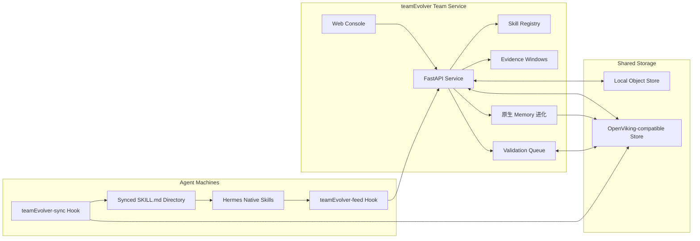
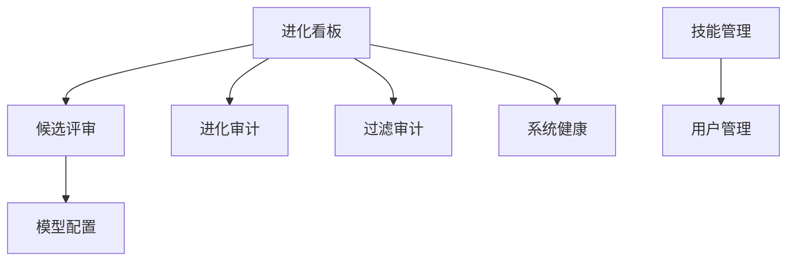
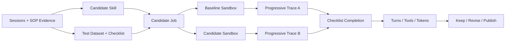

# teamEvolver

<div align="center">

## 面向 Agent 团队的技能库、同步控制台、DreamCycle 与验证工作台

[](https://www.python.org/)
[](https://fastapi.tiangolo.com/)
[](https://react.dev/)
[](./LICENSE)
[](./README.en.md)

**把真实 Agent 使用经验沉淀为可复用、可同步、可验证的 `SKILL.md` 团队资产。**

</div>

---

## 目录

- [为什么需要 teamEvolver？](#为什么需要-teamevolver)
- [设计原则](#设计原则)
- [核心能力](#核心能力)
- [系统图](#系统图)
- [手动安装](#手动安装)
- [控制台概览](#控制台概览)
- [OpenViking / 对象存储](#openviking--对象存储)
- [Langfuse 会话接入](#langfuse-会话接入)
- [SkillMiner 与 LIFT](#skillminer-与-lift)
- [DreamCycle 与验证队列](#dreamcycle-与验证队列)
- [True Replay：用真实轨迹验证技能](#true-replay用真实轨迹验证技能)
- [项目结构](#项目结构)
- [开发](#开发)
- [路线图](#路线图)

---

## 为什么需要 teamEvolver？

Agent 已经能完成复杂任务，但团队技能通常还停留在“某台机器上的一组文件”：

- **技能难共享**：同一条经验在不同成员、不同机器、不同 Agent 里反复复制。
- **资产难分层**：个人偏好、客户事实、团队 SOP 容易混在一起，带来隐私和污染风险。
- **版本难追踪**：技能来源、发布人、版本状态和当前团队空间内容，很难持续对齐。
- **质量难判断**：一个技能看起来写得很好，但是否真的改善任务结果，缺少证据。

**teamEvolver 不是让 Agent 记住更多信息，而是建立从真实 session 到团队能力的安全流水线。**
它把分散会话转成可比较的 evidence，区分个人与团队资产，再用回放验证和版本治理发布团队技能。

---

## 设计原则

- **中心化采集**：保留 session、工具调用、成功策略和失败原因，让系统看见跨人共性。
- **分层沉淀**：先判断是否可共享，再判断应写成 `skill` 还是 `memory`；个人资产隔离，团队资产受控发布。
- **验证发布**：团队 `SKILL.md` 必须经过聚合、脱敏、去重、回放验证、版本化和回滚门控。
- **证据优先**：新候选会带上近期证据、历史证据和 replay case，避免只凭单次成功或单次失败做判断。

Hermes 等 Agent 保持原生运行方式；teamEvolver 通过同步目录和 Hook 把团队技能带到 Agent 原生技能系统里。

---

## 核心能力

<table>
  <tr>
    <td width="25%" valign="top">
      <h3>技能库管理</h3>
      <p>读取、创建、编辑、删除、打包和导入标准 <code>SKILL.md</code> 技能，保留 frontmatter 与附件目录。</p>
    </td>
    <td width="25%" valign="top">
      <h3>团队同步</h3>
      <p>基于 OpenViking 对象存储，支持云上（火山托管）与本地自建两种部署，个人 Key 作为经验来源，团队 Key 作为发布目标。</p>
    </td>
    <td width="25%" valign="top">
      <h3>Web 控制台</h3>
      <p>内置 React + TypeScript 控制台，覆盖技能管理、用户管理、候选评审、健康检查和模型配置。</p>
    </td>
    <td width="25%" valign="top">
      <h3>真实回放</h3>
      <p>True Replay 在隔离沙盒中运行 baseline 与 candidate 分支，用真实工具轨迹评估候选技能。</p>
    </td>
  </tr>
</table>

默认配置已面向完整闭环开启：技能同步、OpenViking 团队空间、session 价值过滤、证据窗口、DreamCycle、验证队列和候选评审都可以直接接入。

---

## 系统图



teamEvolver 的推荐链路是“共享存储 + 本地同步 + Agent 原生加载”。这样 `skills_list`、`skill_view`、`/skills` 等能力仍由 Agent 自己提供，teamEvolver 只负责把团队技能可靠送到本机。

---

## 手动安装

连不上外网时先执行：

```bash
export http_proxy="http://sys-proxy-rd-relay.byted.org:8118"
export https_proxy="http://sys-proxy-rd-relay.byted.org:8118"
export no_proxy="localhost,.byted.org,byted.org,.bytedance.net,bytedance.net,127.0.0.0/8,169.254.0.0/16,100.64.0.0/10,172.16.0.0/12,192.168.0.0/16,10.0.0.0/8,::1,fe80::/10,fd00::/8,33.0.0.0/8,2605:340:CD00::/40,64:ff9b::/96,64:ff9b:1::/48"
```

### Server 端：部署 teamEvolver

```bash
export TEAMEVOLVER_HOST="<server-ip-or-hostname>"

git clone https://github.com/leoriczhang/teamEvolver.git
cd teamEvolver
python -m venv .venv
source .venv/bin/activate
python -m pip install -U pip
python -m pip install -e ".[all]"
npm --prefix web-ui install
npm --prefix web-ui run build

teamEvolver config service.host 0.0.0.0
teamEvolver config service.port 52010
teamEvolver config skills.enabled true
teamEvolver config skills.dir ./skills
teamEvolver config sharing.enabled true
teamEvolver config sharing.backend viking
teamEvolver config sharing.viking_team_api_key "<team-key>"
teamEvolver config sharing.viking_personal_api_key "<personal-key>"
teamEvolver config sharing.viking_root_prefix "team-skill-evolver"
teamEvolver config evolve.evidence_enabled true
teamEvolver config evolve.evidence_recent_limit 12
teamEvolver config evolve.evidence_historical_limit 12
teamEvolver config evolve.evidence_change_debt_threshold 3
# DreamCycle 已内置到 teamEvolver，默认关闭；无需安装外部 dreamcycle 包。
# 开启后从个人 Key 读取经验，写入上面的团队 Key 空间。
# 多台 AgentsHub 接入时，个人 Key 会通过内部配置接口动态合并，无需写死用户。
teamEvolver config dreamcycle.enabled true
teamEvolver config dreamcycle.auto_start true
teamEvolver config validation.enabled true
teamEvolver config validation.mode replay
teamEvolver config validation.required_results 3
teamEvolver config validation.required_approvals 2
teamEvolver config validation.agentshub_url "http://<agentshub-host>:5173"

mkdir -p skills
teamEvolver start --daemon --port 52010
teamEvolver status
curl -fsS "http://127.0.0.1:52010/health"
curl -fsS "http://127.0.0.1:52010/status"
curl -fsS "http://127.0.0.1:52010/trigger-dreamcycle/status"
```

```text
http://<server-ip-or-hostname>:52010/console
```

首次启动时可初始化管理员账号。默认账号与密码均为 `admin`，建议部署后立即修改。

### Client 端：部署 Hermes

```bash
export TEAMEVOLVER_REPO="/path/to/teamEvolver"
export HERMES_HOME="${HERMES_HOME:-$HOME/.hermes}"
export TEAMEVOLVER_URL="http://<server-ip-or-hostname>:52010"
export TEAMEVOLVER_USER="<unique-user-alias-for-this-machine>"
export TEAMEVOLVER_API_KEY=""
TEAMEVOLVER_AUTH_ARGS=()
[ -n "$TEAMEVOLVER_API_KEY" ] && TEAMEVOLVER_AUTH_ARGS=(--api-key "$TEAMEVOLVER_API_KEY")

python "$TEAMEVOLVER_REPO/teamEvolver/integrations/hermes_skill_sync/install.py" \
  --hermes-home "$HERMES_HOME" \
  --python python3 \
  --backend service \
  --url "$TEAMEVOLVER_URL" \
  --user "$TEAMEVOLVER_USER" \
  "${TEAMEVOLVER_AUTH_ARGS[@]}"

python "$TEAMEVOLVER_REPO/teamEvolver/integrations/hermes_skill/install.py" \
  --hermes-home "$HERMES_HOME" \
  --python python3 \
  --user "$TEAMEVOLVER_USER" \
  --url "$TEAMEVOLVER_URL" \
  "${TEAMEVOLVER_AUTH_ARGS[@]}"

python "$HERMES_HOME/skills/teamEvolver-sync/sync_skills.py"
hermes hooks list
curl -fsS "$TEAMEVOLVER_URL/status"
```

如果 Hermes 已经在运行，在 Hermes 会话内执行：

```text
/reload-skills
```

更完整的 coding agent 接入说明见 [docs/coding-agent.md](./docs/coding-agent.md)。

---

## 控制台概览

<div align="center">
  
  <br>
  <sub>teamEvolver 控制台：进化看板、团队技能状态、存储连通性与管理入口。</sub>
</div>



控制台内置以下页面：

- **进化看板**：查看存储连通性、技能数量、候选队列和系统状态。
- **候选评审**：检查待验证候选技能，配合 True Replay 做发布前评估。
- **进化审计**：查看技能演进相关记录。
- **过滤审计**：查看 session 入队前的 valuable / chitchat 判别、模式、置信度和原因。
- **系统健康**：检查服务、存储和关键 API 是否可达。
- **技能管理**：管理个人技能与团队技能，支持上传 zip 包。
- **记忆管理**：管理个人 Memory 与团队共享 Memory，支持目录、文件和 Markdown 内容编辑。
- **OpenViking Workspace**：浏览个人/团队/Skill 上下文树，并跳转到完整 OpenViking Studio。
- **用户管理**：管理团队显示名称、用户、角色，以及个人/团队空间凭据。
- **模型配置**：配置可选验证模型，并提供连通性测试。

团队显示名称由管理员在「用户与权限 → 团队身份」中维护，也可通过 CLI 设置：

```bash
teamEvolver config team.display_name "My Team"
```

部署环境可使用 `EVOLVE_TEAM_DISPLAY_NAME` 覆盖持久化值。DreamCycle 的团队概况、
提示词和 Memory 清洗逻辑都会使用最终生效的团队名称。

---

## OpenViking / 对象存储

远端同步通过 OpenViking 完成，只有两种部署可选：**云上 OpenViking**（火山托管）和**本地 OpenViking**（本机自建 `openviking-server`）。二者仅端点不同，均使用 `viking` 后端。

```bash
teamEvolver config sharing.enabled true
teamEvolver config sharing.backend viking
# 部署选择：cloud（火山托管，默认）或 local（本机自建 openviking-server）
teamEvolver config sharing.viking_deployment cloud
teamEvolver config sharing.viking_team_api_key "<team-key>"
teamEvolver config sharing.viking_personal_api_key "<personal-key>"
teamEvolver config sharing.viking_root_prefix "team-skill-evolver"
```

- **云上 OpenViking**：`viking_deployment=cloud`，端点默认 `https://api.vikingdb.cn-beijing.volces.com/openviking`。
- **本地 OpenViking**：`viking_deployment=local`，端点默认 `http://localhost:1933`（本机 `openviking-server`）。

两种部署也可在控制台「系统健康 → OpenViking 部署」面板中一键切换（管理员）。

OpenViking 空间分工：

- `sharing.viking_personal_api_key`：当前机器或当前用户的个人经验来源。
- `sharing.viking_team_api_key`：团队技能、验证任务、验证结果和 DreamCycle 产物的共享目标。
- `sharing.viking_root_prefix`：跨 Agent 共享命名空间，默认固定为 `team-skill-evolver`。

Agent 通过通用 `/internal/agents/register` 接口注册运行时类型、能力和回放/Skill 同步端点；旧版 AgentsHub 的 `/internal/agentshub/openviking-config` 仍保留兼容适配。本地部署时 teamEvolver 是 OpenViking 配置权威，外部 Agent 不能覆盖本地 endpoint 或凭据。

本地 OpenViking 推荐直接使用最新开源版及其 Web Studio：

```bash
# 默认读取 ~/OpenViking 和 ~/.openviking/ov.conf；首次启动会构建 Web Studio
bash scripts/start_local_openviking.sh

# 切换 teamEvolver 到本地服务，endpoint 留空时自动使用 localhost:1933
teamEvolver config sharing.viking_deployment local
teamEvolver config sharing.viking_endpoint ""
teamEvolver start
```

Python 环境不在默认位置时，通过 `OPENVIKING_PYTHON=/path/to/python` 指定；源码或配置位于其他目录时，使用 `OPENVIKING_REPO`、`OPENVIKING_CONFIG` 覆盖。完整 Studio 默认位于 `http://127.0.0.1:1933/studio/`。

若本地 `ov.conf` 配置了 `server.root_api_key`，需要把这个本地 Key 配置到 teamEvolver 管理员的个人/团队 OpenViking 空间；云端 Key 不能用于本地服务。

teamEvolver 的 workspace 管理直接复用 OpenViking 原生 `fs` 与 `content` API，空间映射如下：

| 管理范围 | OpenViking 根 URI | 写权限 |
| --- | --- | --- |
| 个人 Memory | `viking://user/<personal-user>/memories` | 本人或管理员 |
| 团队 Memory | `viking://user/<team-user>/memories` | 管理员 |
| 个人 Skill | `viking://resources/team-skill-evolver/peers/<user>/skills` | 本人或管理员 |
| 团队 Skill | `viking://resources/team-skill-evolver/skills` | 管理员 |

浏览器只访问 teamEvolver 的受控代理，OpenViking Key 由服务端注入，URI 也被限制在所选根目录内。

如需自定义地址，用 `teamEvolver config sharing.viking_endpoint "<your-server-url>"` 覆盖部署默认端点。

### 通用 Agent 接入

任意 Agent 运行时可向 `POST /internal/agents/register` 提交：

```json
{
  "agent_id": "my-agent:tenant-a",
  "runtime_type": "my-agent",
  "display_name": "My Agent",
  "capabilities": ["session_ingest", "true_replay", "skill_sync"],
  "endpoints": {
    "health_url": "http://agent-host/health",
    "replay_url": "http://agent-host/replay",
    "skill_sync_url": "http://agent-host/sync"
  },
  "metadata": {"tenant_id": "tenant-a"}
}
```

注册表只保存非敏感运行时元数据，不保存 Agent 提交的 Key/Token。会话通过现有 `/ingest_session` 进入进化流程，并在 `runtime.type`、`runtime.integration_id` 中声明回放运行时；True Replay 会按注册表解析对应回放端点。

不要把真实 API Key 写入仓库。建议使用本机配置、环境变量或部署系统的 Secret 管理能力注入。

---

## Langfuse 会话接入

除 Hermes / AgentsHub 主动推送外，teamEvolver 还能直接从 [Langfuse](https://langfuse.com)
拉取 Agent 会话作为进化证据。集成基于 Langfuse **v3.117.2** 的公开 REST API（`/api/public/*`，
HTTP Basic 认证：public key 作用户名、secret key 作密码），使用内置 `httpx` 直连，不绑定特定
`langfuse` SDK 版本。

一个 Langfuse **session** 会映射为一个 teamEvolver session，其下每条 **trace** 折叠为一个交互
轮次（turn），`GENERATION` 观测提供 token 用量、`tool_calls` 与工具结果映射为工具调用记录。拉取
到的会话与 `/ingest_session` 走**同一条**去重、价值分类、入队与进化触发链路。

### 配置

```bash
teamEvolver config langfuse.enabled true
teamEvolver config langfuse.host "https://cloud.langfuse.com"   # 自部署填自己的地址
teamEvolver config langfuse.public_key "pk-lf-..."
teamEvolver config langfuse.secret_key "sk-lf-..."
teamEvolver config langfuse.max_sessions 100                    # 单次拉取上限
# 可选：默认会话属性过滤（拉取时未显式指定则生效）
teamEvolver config langfuse.default_environment "production,staging"
teamEvolver config langfuse.default_tags "agent,eval"
teamEvolver config langfuse.default_user_id ""
```

凭据切勿写入仓库，建议通过本机配置或 Secret 注入。

### 会话属性筛选

`/sessions` 列表端点仅支持按时间与 `environment` 过滤，而 Agent 会话通常在 **trace** 层带有更丰富的
属性。因此只要指定了任一 trace 级过滤条件（`user_id` / `tags` / `release` / `version` / `name` /
`metadata`），客户端会改走支持这些属性的 `/traces` 端点来解析匹配的 session id；否则回退到轻量的
`/sessions` 列表。`metadata` 过滤会转换为 Langfuse v3 的高级 `filter` JSON（`stringObject` 等）。

### CLI

```bash
# 连通性与当前默认过滤器
teamEvolver langfuse status

# 仅列出匹配会话（不入库），可组合任意过滤条件
teamEvolver langfuse list \
  --environment production --tag agent --user-id u-123 \
  --from 2026-08-01T00:00:00Z --metadata customer_tier=enterprise

# 拉取并进入进化流水线（默认 POST 到运行中的服务，复用触发链路）
teamEvolver langfuse pull --environment production --tag agent --max-sessions 20

# 无服务时本地直接入库
teamEvolver langfuse pull --session-id <sid> --in-process
```

支持的过滤标志：`--environment/-e`（可重复）、`--user-id/-u`、`--tag`（可重复，全部匹配）、
`--release`、`--version`、`--name`、`--session-id`、`--from`、`--to`、`--metadata/-m key=value`
（可重复）、`--max-sessions`。

### REST 端点

- `GET /langfuse/status` — 连通性探测与默认过滤器快照。
- `POST /langfuse/sessions` — 按过滤条件列出匹配会话（不入库），返回轻量属性（用户、标签、环境、trace 数）。
- `POST /langfuse/pull` — 拉取、转换并入库；受 `EVOLVE_INGEST_API_KEY` 保护（若已设置）。

请求体字段与 CLI 一致：`environment`、`user_id`、`tags`、`release`、`version`、`trace_name`、
`session_id`、`from_timestamp`、`to_timestamp`、`metadata`、`max_sessions`、`user_alias`、
`force_reprocess`、`defer_evolution_trigger`。

---

## SkillMiner 与 LIFT

统一控制台内置 SkillMiner 文档挖掘流程，可从领域文档生成样本包、语义报告、候选
`SKILL.md` 和内部 `benchmark.jsonl`。挖掘产物不会直接发布，而是提交到现有候选评审
队列，继续经过 A/B 回放、Checklist 门禁和人工发布。

SkillMiner 通过**项目虚拟环境内的 Hermes CLI**执行模型任务。安装脚本会把固定版本的 Hermes 安装到本项目 `.venv`，运行时使用独立的 `teamEvolver/skillminer/.hermes_home`；不会发现、调用或修改系统全局 Hermes 与 `~/.hermes`：

```bash
bash scripts/install_teamEvolver.sh
# 验证/配置项目 Hermes（不会影响全局 Hermes）
scripts/project_hermes.sh --version
scripts/project_hermes.sh model
# 仅部署进化服务，不启用文档挖掘
bash scripts/install_teamEvolver.sh --skip-hermes
```

项目模型配置位于 `teamEvolver/skillminer/.hermes_home/config.yaml`，首次运行从无密钥模板 `teamEvolver/skillminer/hermes/config.yaml.example` 初始化。可直接修改 provider、模型、base URL、上下文长度等；并行挖掘任务会各自复制配置快照，互不写入彼此状态。

内置 Hermes 仅作为 SkillMiner 的模型执行器：运行时会强制移除 session feed、远程技能同步 Hook、外部技能目录和进化服务环境变量，不会自动参与团队进化。Skill 与 Benchmark 只有在人工审核并点击“提交进化”后才会进入候选评审队列。

LIFT 是可选的外部评测工作区，不会复制进 teamEvolver 安装包：

```bash
bash scripts/setup_lift.sh
# 同时创建 LIFT Python 环境
bash scripts/setup_lift.sh --install-deps
```

详细的数据契约、环境变量和流水线操作见
[`teamEvolver/skillminer/README.md`](./teamEvolver/skillminer/README.md)。

---

## DreamCycle 与验证队列

DreamCycle 负责维护团队长期经验，验证队列负责把候选技能放到真实或模拟回放里评估。两者都复用 OpenViking 对象存储边界：

> DreamCycle 现为 teamEvolver 原生完整能力，无需安装外部包。它包含团队概况、去重、清理、新人可发现性、个人经验团队化 5 个 Job，以及 ReAct 多轮工具调用、OpenViking 读写/归档、策略审计、报告、夜间多轮调度与历史状态。

```bash
teamEvolver config dreamcycle.enabled true       # 开启可选维护
teamEvolver config dreamcycle.auto_start true    # 可选：服务内周期运行
teamEvolver config dreamcycle.llm_api_key "<llm-key>"
teamEvolver config dreamcycle.llm_model "<model-id>"
```

1. `teamEvolver-feed` 上传真实 session，入口先做 valuable / chitchat 判别。
2. 进化流程从近期 Session、历史 Session 和跨周期团队 SOP evidence 中同步构造候选 Skill 与 test datasets。
3. DreamCycle 读取个人 Key 来源，写入团队 Key 空间，避免把个人偏好直接发布成团队 SOP。
4. 候选技能进入 `validation_jobs/`，各客户端在空闲时写入 `validation_results/`。
5. True Replay 在合成的 test datasets 上渐进执行 Checklist，并沉淀轮次、Tool 调用和 Token；控制台据此发布、拒绝或人工处理候选。

常用操作：

```bash
teamEvolver config show
curl -fsS "http://127.0.0.1:52010/trigger-dreamcycle/status"
curl -fsS -X POST "http://127.0.0.1:52010/trigger-dreamcycle"
curl -fsS "http://127.0.0.1:52010/validation/candidates"
```

验证模式默认使用轻量 replay。具备 Hermes True Replay 运行时后，可以切到真实分支回放：

```bash
teamEvolver config validation.mode true_replay
teamEvolver config validation.max_jobs_per_day 5
teamEvolver config validation.max_concurrency 1
```

---

## True Replay：用真实轨迹验证技能

普通文本 A/B 只能判断回答像不像；True Replay 会在隔离环境中启动真实 Agent，对 baseline 和 candidate 两个分支分别执行任务。候选 Skill 生成时，Dataset Synthesizer 使用同一批 Session 与团队 SOP evidence 同步生成带 12–24 条扁平 Checklist 的 test datasets。

每条 case 的第 1 轮只向 Agent 披露初始 Query。独立 Checklist judge 根据真实回复、Tool events 与产物检查未满足项；后续每轮只披露下一批未满足要求，直到全部满足或达到轮次上限。Checklist 是完成条件，不计算综合分数。两边完成情况相同时，最终按以下客观效率指标判定：

1. 达成任务所需的交互轮次，越少越好。
2. 工具调用次数，越少通常说明执行路径越直接。
3. Total tokens，并同时保留 input/output/cache/reasoning token 明细。



安装依赖：

```bash
python -m pip install -e ".[truereplay]"
```

从验证队列回放：

```bash
python -m teamEvolver.true_replay --job-id <validation-job-id> --json
```

使用本地 JSON 文件独立回放：

```bash
python -m teamEvolver.true_replay --job-file ./candidate_job.json --dry-run
python -m teamEvolver.true_replay --job-file ./candidate_job.json --json
```

True Replay 会为两条分支创建临时 `HOME` 与 `HERMES_HOME`，不会修改真实 Agent 配置。若使用本地 Agent checkout，可通过 `HERMES_ORIGIN` 指定源码位置。

在控制台候选评审中，管理员可以对同一个候选执行重新评估、验证发布、强制发布或删除。`Skills 实验台` 与自动 True Replay 使用同一渐进协议，并可从历史 Session / SOP evidence 独立生成可编辑数据集、上传材料和查看完整 A/B Trace。

---

## 项目结构

```text
teamEvolver/
├── teamEvolver/
│   ├── cli/              # teamEvolver 命令行
│   ├── config_store/     # 本地配置读写
│   ├── proxy/            # 服务路由、控制台与管理接口
│   ├── skills/           # SKILL.md 管理、打包、同步
│   ├── storage/          # OpenViking 存储后端（云上 / 本地）
│   ├── integrations/     # Hermes / DreamCycle 集成
│   ├── validation/       # 共享验证队列、结果与 worker
│   ├── true_replay.py    # 真实 A/B 回放
│   └── web/              # 控制台构建产物
├── web-ui/               # React + TypeScript 控制台源码
├── tests/
├── scripts/
└── pyproject.toml
```

---

## 开发

```bash
python -m pip install -e ".[dev,all]"
python -m pytest
```

构建前端与 Python 包：

```bash
npm --prefix web-ui install
npm --prefix web-ui run build
python -m pip install build
python -m build
```

---

## 路线图

- 增强 DreamCycle 策略：更细粒度地区分个人记忆、团队记忆和可发布技能。
- 扩展 True Replay：增加多 case 回放、视觉产物 QA 和更稳定的效率基线。
- 完善候选治理：支持多人审批、批量拒绝、发布后回滚和更细的版本对比。
- 强化控制台体验：增加验证产物实时预览、队列趋势和跨用户贡献统计。

---

## 参考与引用

相关项目与资料：
- [SkillClaw](https://github.com/AMAP-ML/SkillClaw)：多 Angent skills 进化项目。
- [OpenSpace](https://github.com/HKUDS/OpenSpace)：质量优先的 Agent Skill Hub。
- [Hermes Agent](https://github.com/nousresearch/hermes-agent)：可选 True Replay 运行时依赖。
- [FastAPI](https://fastapi.tiangolo.com/)：teamEvolver 服务端框架。
- [React](https://react.dev/) 与 [TypeScript](https://www.typescriptlang.org/)：teamEvolver 控制台技术栈。

---

## License

MIT
