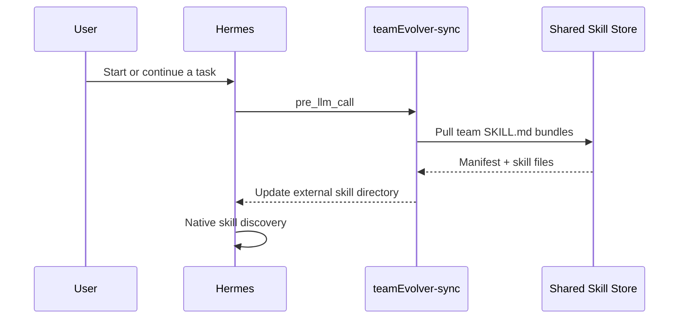

# Coding Agent Integration Guide

This document is for coding agents that need to connect Hermes machines to a central teamEvolver service and enable team skill sync, session upload, and automatic evolution.

## Single-Port Contract

teamEvolver uses port `52010`. The central service at `http://<teamEvolver-host>:52010` serves:

- `GET /health` / `GET /healthz`: health checks.
- `GET /status`: evolution status, pending session count, and registered skill count.
- `POST /ingest_session`: Hermes session ingestion, called by `teamEvolver-feed`.
- `POST /trigger`: immediate evolve-cycle trigger; the background scanner still polls the `sessions/` queue.
- `GET /sessions`, `GET /conversations`, `GET /validation/candidates`, `GET /storage/status`: console and inspection APIs.
- `GET /console`: web console.

## Inputs

```bash
export TEAMEVOLVER_REPO="/path/to/teamEvolver"
export HERMES_HOME="${HERMES_HOME:-$HOME/.hermes}"
export TEAMEVOLVER_HOST="<center-linux-intranet-ip>"
export TEAMEVOLVER_PORT="52010"
export TEAMEVOLVER_URL="http://${TEAMEVOLVER_HOST}:${TEAMEVOLVER_PORT}"
export TEAMEVOLVER_USER="<unique-user-alias-for-this-machine>"
export TEAMEVOLVER_API_KEY=""
TEAMEVOLVER_AUTH_ARGS=()
[ -n "$TEAMEVOLVER_API_KEY" ] && TEAMEVOLVER_AUTH_ARGS=(--api-key "$TEAMEVOLVER_API_KEY")
```

`TEAMEVOLVER_USER` must distinguish machines or employees. It appears in console session history and attribution.

## Central Machine

```bash
cd "$TEAMEVOLVER_REPO"
python -m pip install -U pip
python -m pip install -e ".[all]"
npm --prefix web-ui install
npm --prefix web-ui run build

teamEvolver config service.host 0.0.0.0
teamEvolver config service.port 52010
teamEvolver config sharing.enabled true
teamEvolver config sharing.backend viking
# teamEvolver config sharing.viking_team_api_key "<team-key>"
# teamEvolver config sharing.viking_personal_api_key "<personal-key>"
# teamEvolver config sharing.viking_root_prefix "team-skill-evolver"

teamEvolver stop || true
teamEvolver start --daemon --port 52010
```

```bash
ss -ltnp | grep 52010
curl -fsS "$TEAMEVOLVER_URL/health"
curl -fsS "$TEAMEVOLVER_URL/status"
curl -fsS -X POST "$TEAMEVOLVER_URL/trigger"
```

## Hermes Machine

Do not distribute the OpenViking team key to Hermes machines. Prefer the teamEvolver service backend: local Hermes machines only need `TEAMEVOLVER_URL` and `TEAMEVOLVER_USER`; OpenViking endpoint, key, and root prefix stay on the central service.

### Install the Team Skill Sync Hook

```bash
python "$TEAMEVOLVER_REPO/teamEvolver/integrations/hermes_skill_sync/install.py" \
  --hermes-home "$HERMES_HOME" \
  --backend service \
  --url "$TEAMEVOLVER_URL" \
  --user "$TEAMEVOLVER_USER" \
  "${TEAMEVOLVER_AUTH_ARGS[@]}"
```

The installer:

- Copies `teamEvolver-sync` to `$HERMES_HOME/skills/teamEvolver-sync/`.
- Writes `$HERMES_HOME/skills/teamEvolver-sync/sync.json`.
- Adds `$HERMES_HOME/team_skills/teamEvolver` to Hermes `skills.external_dirs`.
- Registers the `pre_llm_call` hook to pull team skills before model calls.
- Writes scoped hook allowlist approval to avoid first-run TTY approval.

### Install the Session Upload Hook

```bash
python "$TEAMEVOLVER_REPO/teamEvolver/integrations/hermes_skill/install.py" \
  --hermes-home "$HERMES_HOME" \
  --user "$TEAMEVOLVER_USER" \
  --url "$TEAMEVOLVER_URL" \
  "${TEAMEVOLVER_AUTH_ARGS[@]}"
```

The installer:

- Copies `teamEvolver-feed` to `$HERMES_HOME/skills/teamEvolver-feed/`.
- Writes `$HERMES_HOME/skills/teamEvolver-feed/feed.json`.
- Registers the `on_session_end` hook to POST `/ingest_session` after Hermes sessions.
- Uploads `injected_skills`, `used_skills`, tool calls, tool results, and token metrics.

### Verify Sync and Hooks

```bash
python "$HERMES_HOME/skills/teamEvolver-sync/sync_skills.py"
hermes hooks list
hermes hooks test pre_llm_call
hermes hooks test on_session_end
```

It is normal for the synthetic `on_session_end` test to print skipped; it has no real Hermes session body to upload. The real check is to complete one normal Hermes conversation and confirm that `TEAMEVOLVER_USER` appears in the teamEvolver console session history.

If Hermes is already running, execute:

```text
/reload-skills
```

New sessions load synced team skills automatically.

## Success Criteria

The coding agent must confirm:

```bash
curl -fsS "$TEAMEVOLVER_URL/status"
curl -fsS -X POST "$TEAMEVOLVER_URL/trigger"
test -f "$HERMES_HOME/skills/teamEvolver-sync/sync.json"
test -f "$HERMES_HOME/skills/teamEvolver-feed/feed.json"
test -d "$HERMES_HOME/team_skills/teamEvolver"
hermes hooks list
```

Success state:

- `status.running == true`.
- `POST /trigger` returns JSON, not nginx 403/404.
- `sync.json.base_url` and `feed.json.base_url` are both `http://<teamEvolver-host>:52010`.
- `skills.external_dirs` includes `$HERMES_HOME/team_skills/teamEvolver`.
- The hook allowlist includes commands for `teamEvolver-sync` and `teamEvolver-feed`.

## Team Skill Sync Flow



The installer writes configuration similar to:

```yaml
skills:
  external_dirs:
    - <HERMES_HOME>/team_skills/teamEvolver
hooks:
  pre_llm_call:
    - command: "python3 <HERMES_HOME>/skills/teamEvolver-sync/sync_skills.py"
      timeout: 60
```

The generated `sync.json` is similar to:

```json
{
  "backend": "service",
  "base_url": "http://<teamEvolver-host>:52010",
  "user_alias": "<teamEvolver-user>",
  "target_dir": "<HERMES_HOME>/team_skills/teamEvolver"
}
```

## Session Attribution and Efficiency Metrics

The `teamEvolver-feed` `on_session_end` hook reads the complete Hermes trajectory from `state.db`, including system, user, assistant, tool messages, tool calls, and tool results:

- `injected_skills`: skills exposed in the system prompt's `<available_skills>` block.
- `used_skills`: skills loaded through `skill_view`.
- `metrics`: interaction turns, tool-call count, and input/output/cache/reasoning tokens.

These fields are sent through `/ingest_session` and preserved in the session archive and console details.

## Troubleshooting

- If `POST /trigger` returns the default nginx `403`, first check that requests are not using an HTTP proxy:

  ```bash
  curl --noproxy '*' -v "$TEAMEVOLVER_URL/status"
  curl --noproxy '*' -v -X POST "$TEAMEVOLVER_URL/trigger"
  export NO_PROXY="${TEAMEVOLVER_HOST},10.0.0.0/8,127.0.0.1,localhost"
  ```

- If `52010/trigger` returns 404, the central service is not on the current single-port version or was not restarted with the latest code.
- If `52010/ingest_session` returns `session_id is required`, the service is reachable; this is the expected validation error for an empty body.
- If skills do not sync, check `/storage/status`, then check the OpenViking settings on the central machine.
- Do not distribute the OpenViking team key to Hermes machines; use `--backend service` by default.
