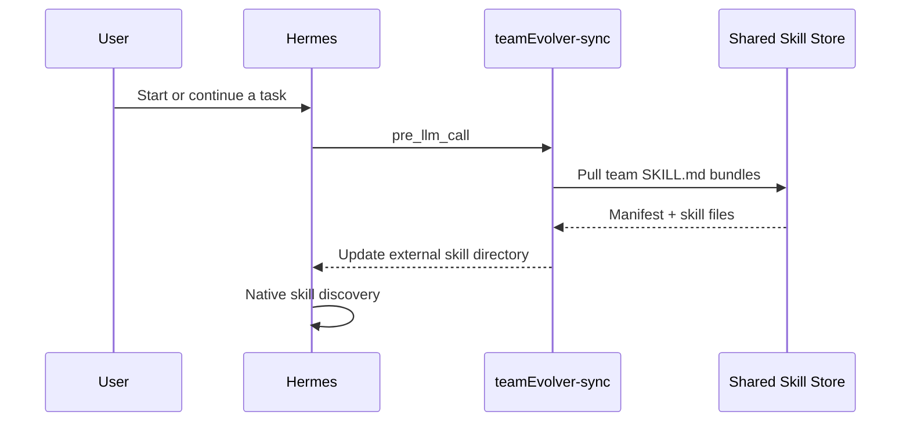

# Coding Agent 接入指南

本文档给 coding agent 使用，用于把 Hermes 机器接入中心 teamEvolver 服务，形成“团队技能同步 + 会话回流 + 自动进化”的闭环。

## 单端口约定

teamEvolver 统一使用 `52010` 端口。中心机 `http://<teamEvolver-host>:52010` 同时承载：

- `GET /health` / `GET /healthz`：服务健康检查。
- `GET /status`：进化服务状态、排队 session 数和注册技能数。
- `POST /ingest_session`：Hermes 会话投喂入口，由 `teamEvolver-feed` 调用。
- `POST /trigger`：立即触发一次 evolve cycle；后台仍会周期扫描 `sessions/` 队列。
- `GET /sessions`、`GET /conversations`、`GET /validation/candidates`、`GET /storage/status`：控制台和巡检接口。
- `GET /console`：Web 控制台。

## 输入变量

```bash
export TEAMEVOLVER_REPO="/path/to/teamEvolver"
export HERMES_HOME="${HERMES_HOME:-$HOME/.hermes}"
export TEAMEVOLVER_HOST="<center-linux-intranet-ip>"
export TEAMEVOLVER_PORT="52010"
export TEAMEVOLVER_URL="http://${TEAMEVOLVER_HOST}:${TEAMEVOLVER_PORT}"
export TEAMEVOLVER_USER="<unique-user-alias-for-this-machine>"
export TEAMEVOLVER_API_KEY=""
TEAMEVOLVER_AUTH_ARGS=()
[ -n "$TEAMEVOLVER_API_KEY" ] && TEAMEVOLVER_AUTH_ARGS=(--api-key "$TEAMEVOLVER_API_KEY")
```

`TEAMEVOLVER_USER` 必须能区分不同机器或员工；它会出现在控制台“会话历史”中，也用于后续归因。

## 中心机部署

```bash
cd "$TEAMEVOLVER_REPO"
python -m pip install -U pip
python -m pip install -e ".[all]"
npm --prefix web-ui install
npm --prefix web-ui run build

teamEvolver config service.host 0.0.0.0
teamEvolver config service.port 52010
teamEvolver config sharing.enabled true
teamEvolver config sharing.backend viking
# teamEvolver config sharing.viking_team_api_key "<team-key>"
# teamEvolver config sharing.viking_personal_api_key "<personal-key>"
# teamEvolver config sharing.viking_root_prefix "team-skill-evolver"

teamEvolver stop || true
teamEvolver start --daemon --port 52010
```

```bash
ss -ltnp | grep 52010
curl -fsS "$TEAMEVOLVER_URL/health"
curl -fsS "$TEAMEVOLVER_URL/status"
curl -fsS -X POST "$TEAMEVOLVER_URL/trigger"
```

## Hermes 机器接入

Hermes 机器不要配置 OpenViking team key。推荐全部走 teamEvolver 服务后端：本机只知道 `TEAMEVOLVER_URL` 和 `TEAMEVOLVER_USER`，底层 OpenViking endpoint、key、root prefix 留在中心 teamEvolver 服务里。

### 安装团队技能同步 hook

```bash
python "$TEAMEVOLVER_REPO/teamEvolver/integrations/hermes_skill_sync/install.py" \
  --hermes-home "$HERMES_HOME" \
  --backend service \
  --url "$TEAMEVOLVER_URL" \
  --user "$TEAMEVOLVER_USER" \
  "${TEAMEVOLVER_AUTH_ARGS[@]}"
```

该脚本会：

- 复制 `teamEvolver-sync` 到 `$HERMES_HOME/skills/teamEvolver-sync/`。
- 写入 `$HERMES_HOME/skills/teamEvolver-sync/sync.json`。
- 把 `$HERMES_HOME/team_skills/teamEvolver` 加入 Hermes `skills.external_dirs`。
- 注册 `pre_llm_call` hook，在每次模型调用前拉取团队技能。
- 写入 scoped hook allowlist approval，避免首次运行被 TTY 授权卡住。

### 安装会话回流 hook

```bash
python "$TEAMEVOLVER_REPO/teamEvolver/integrations/hermes_skill/install.py" \
  --hermes-home "$HERMES_HOME" \
  --user "$TEAMEVOLVER_USER" \
  --url "$TEAMEVOLVER_URL" \
  "${TEAMEVOLVER_AUTH_ARGS[@]}"
```

该脚本会：

- 复制 `teamEvolver-feed` 到 `$HERMES_HOME/skills/teamEvolver-feed/`。
- 写入 `$HERMES_HOME/skills/teamEvolver-feed/feed.json`。
- 注册 `on_session_end` hook，在每次 Hermes 会话结束后 POST `/ingest_session`。
- 上传 `injected_skills`、`used_skills`、tool calls、tool results 和 token metrics。

### 验证同步和 hook

```bash
python "$HERMES_HOME/skills/teamEvolver-sync/sync_skills.py"
hermes hooks list
hermes hooks test pre_llm_call
hermes hooks test on_session_end
```

`on_session_end` 的 synthetic test 如果输出 skipped 是正常的；它没有真实 Hermes session 正文可上传。真实验证方式是让 Hermes 完成一轮普通对话，然后看 teamEvolver 控制台“会话历史”是否出现 `TEAMEVOLVER_USER`。

如果 Hermes 已经在运行，在 Hermes 会话内执行：

```text
/reload-skills
```

新会话会自动读取同步后的团队技能。

## 接入成功判据

coding agent 必须逐项确认：

```bash
curl -fsS "$TEAMEVOLVER_URL/status"
curl -fsS -X POST "$TEAMEVOLVER_URL/trigger"
test -f "$HERMES_HOME/skills/teamEvolver-sync/sync.json"
test -f "$HERMES_HOME/skills/teamEvolver-feed/feed.json"
test -d "$HERMES_HOME/team_skills/teamEvolver"
hermes hooks list
```

成功状态：

- `status.running == true`。
- `POST /trigger` 返回 JSON，不是 nginx 403/404。
- `sync.json.base_url` 和 `feed.json.base_url` 都是 `http://<teamEvolver-host>:52010`。
- `skills.external_dirs` 包含 `$HERMES_HOME/team_skills/teamEvolver`。
- hook allowlist 中有 `teamEvolver-sync` 和 `teamEvolver-feed` 对应命令。

## 团队技能同步原理



安装脚本会写入类似配置：

```yaml
skills:
  external_dirs:
    - <HERMES_HOME>/team_skills/teamEvolver
hooks:
  pre_llm_call:
    - command: "python3 <HERMES_HOME>/skills/teamEvolver-sync/sync_skills.py"
      timeout: 60
```

对应的 `sync.json` 类似：

```json
{
  "backend": "service",
  "base_url": "http://<teamEvolver-host>:52010",
  "user_alias": "<teamEvolver-user>",
  "target_dir": "<HERMES_HOME>/team_skills/teamEvolver"
}
```

## 会话技能归因与效率指标

`teamEvolver-feed` 的 `on_session_end` hook 会从 Hermes `state.db` 上传完整轨迹，完整保留 system、user、assistant、tool 消息，以及工具调用和工具结果：

- `injected_skills`：system prompt 的 `<available_skills>` 中实际暴露的技能。
- `used_skills`：本次对话实际通过 `skill_view` 加载的技能。
- `metrics`：交互轮次、工具调用次数，以及 input/output/cache/reasoning tokens。

这些字段会随 `/ingest_session` 一起进入会话归档和控制台详情。

## 常见问题

- 如果 `POST /trigger` 返回 nginx 默认 `403`，先确认没有走 HTTP 代理：

  ```bash
  curl --noproxy '*' -v "$TEAMEVOLVER_URL/status"
  curl --noproxy '*' -v -X POST "$TEAMEVOLVER_URL/trigger"
  export NO_PROXY="${TEAMEVOLVER_HOST},10.0.0.0/8,127.0.0.1,localhost"
  ```

- 如果 `52010/trigger` 返回 404，说明中心服务不是当前单端口版，或没有重启到最新代码。
- 如果 `52010/ingest_session` 返回 `session_id is required`，说明服务可达；这是空 body 的预期校验错误。
- 如果同步不到技能，先查 `/storage/status`，再查中心机 OpenViking 配置。
- 不要把 OpenViking team key 分发到每台 Hermes 机器；默认使用 `--backend service`。
