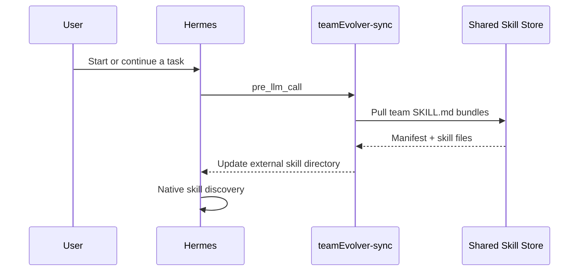

# Hermes Coding Agent Integration Guide

This document is for Coding Agent users, guiding how to connect Hermes machines to central teamEvolver service, forming closed loop of "team skill sync + session feedback + auto-evolution".

## Single Port Convention

teamEvolver uniformly uses port `52010`. Central machine `http://<teamEvolver-host>:52010` simultaneously hosts:

| Path | Method | Description |
|------|--------|-------------|
| `/health` | GET | Service health check |
| `/healthz` | GET | Liveness probe, returns `{"ok": true}` |
| `/status` | GET | Evolution service status, queued Session count and registered skills count |
| `/ingest_session` | POST | Hermes session feed entry, called by `teamEvolver-feed` hook |
| `/trigger` | POST | Immediately triggers one evolve cycle; background still periodically scans sessions queue |
| `/sessions` | GET | Session list in queue |
| `/conversations` | GET | Processed session history list |
| `/validation/candidates` | GET | Candidate Skill list awaiting review |
| `/storage/status` | GET | Shared storage status |
| `/console` | GET | Web console (SPA) |

Related code: `teamEvolver/proxy/routes.py` (route registration), `teamEvolver/proxy/server.py` (service startup)

## Network Proxy

If external network unavailable first execute:

```bash
export http_proxy="http://sys-proxy-rd-relay.byted.org:8118"
export https_proxy="http://sys-proxy-rd-relay.byted.org:8118"
export no_proxy="localhost,.byted.org,byted.org,.bytedance.net,bytedance.net,127.0.0.0/8,169.254.0.0/16,100.64.0.0/10,172.16.0.0/12,192.168.0.0/16,10.0.0.0/8,::1,fe80::/10,fd00::/8,33.0.0.0/8,2605:340:CD00::/40,64:ff9b::/96,64:ff9b:1::/48"
```

## Environment Variables

```bash
export TEAMEVOLVER_REPO="/path/to/teamEvolver"
export HERMES_HOME="${HERMES_HOME:-$HOME/.hermes}"
export TEAMEVOLVER_HOST="<center-linux-intranet-ip>"
export TEAMEVOLVER_PORT="52010"
export TEAMEVOLVER_URL="http://${TEAMEVOLVER_HOST}:${TEAMEVOLVER_PORT}"
export TEAMEVOLVER_USER="<unique-user-alias-for-this-machine>"
export TEAMEVOLVER_API_KEY=""
TEAMEVOLVER_AUTH_ARGS=()
[ -n "$TEAMEVOLVER_API_KEY" ] && TEAMEVOLVER_AUTH_ARGS=(--api-key "$TEAMEVOLVER_API_KEY")
```

`TEAMEVOLVER_USER` must distinguish different machines or employees; it appears in console "Session History" and also used for subsequent attribution.

## Central Machine Deployment

```bash
cd "$TEAMEVOLVER_REPO"
python -m pip install -U pip
python -m pip install -e ".[all]"
npm --prefix web-ui install
npm --prefix web-ui run build

teamEvolver config service.host 0.0.0.0
teamEvolver config service.port 52010
teamEvolver config sharing.enabled true
teamEvolver config sharing.backend viking
# Compatibility field name; set the service/admin key here, normally the admin OpenViking key.
# teamEvolver config sharing.viking_team_api_key "<admin-openviking-key>"
# teamEvolver config sharing.viking_personal_api_key "<personal-key>"
# teamEvolver config sharing.viking_root_prefix "team-skill-evolver"

teamEvolver stop || true
teamEvolver start --daemon --port 52010
```

Post-deployment verification:

```bash
ss -ltnp | grep 52010
curl -fsS "$TEAMEVOLVER_URL/health"
curl -fsS "$TEAMEVOLVER_URL/status"
curl -fsS -X POST "$TEAMEVOLVER_URL/trigger"
```

Related code: `teamEvolver/proxy/server.py` (service startup logic), `teamEvolver/cli/daemon.py` (daemon CLI)

## Hermes Machine Setup

Hermes machines should **NOT** configure an OpenViking service/admin key. Recommend all going through teamEvolver service backend: local machine only knows `TEAMEVOLVER_URL` and `TEAMEVOLVER_USER`; underlying OpenViking endpoint, key, root prefix remain in central teamEvolver service.

### Install Team Skill Sync Hook

```bash
python "$TEAMEVOLVER_REPO/teamEvolver/integrations/hermes_skill_sync/install.py" \
  --hermes-home "$HERMES_HOME" \
  --python python3 \
  --backend service \
  --url "$TEAMEVOLVER_URL" \
  --user "$TEAMEVOLVER_USER" \
  "${TEAMEVOLVER_AUTH_ARGS[@]}"
```

Installation script code: `teamEvolver/integrations/hermes_skill_sync/install.py`

This script will:

- Copy `teamEvolver-sync` to `$HERMES_HOME/skills/teamEvolver-sync/`;
- Write `$HERMES_HOME/skills/teamEvolver-sync/sync.json`;
- Add `$HERMES_HOME/team_skills/teamEvolver` to Hermes `skills.external_dirs`;
- Register `pre_llm_call` hook to pull team skills before each model call;
- Write scoped hook allowlist approval to avoid TTY authorization blocking first run.

Core sync logic: `teamEvolver/integrations/hermes_skill_sync/sync_skills.py`

### Install Session Feedback Hook

```bash
python "$TEAMEVOLVER_REPO/teamEvolver/integrations/hermes_skill/install.py" \
  --hermes-home "$HERMES_HOME" \
  --python python3 \
  --user "$TEAMEVOLVER_USER" \
  --url "$TEAMEVOLVER_URL" \
  "${TEAMEVOLVER_AUTH_ARGS[@]}"
```

Installation script code: `teamEvolver/integrations/hermes_skill/install.py`

This script will:

- Copy `teamEvolver-feed` to `$HERMES_HOME/skills/teamEvolver-feed/`;
- Write `$HERMES_HOME/skills/teamEvolver-feed/feed.json`;
- Register `on_session_end` hook to POST `/ingest_session` after each Hermes session ends;
- Upload `injected_skills`, `used_skills`, tool calls, tool results, and token metrics.

Core push logic: `teamEvolver/integrations/hermes_skill/push_session.py`

### Hook Verification

```bash
python "$HERMES_HOME/skills/teamEvolver-sync/sync_skills.py"
hermes hooks list
hermes hooks test pre_llm_call
hermes hooks test on_session_end
```

`on_session_end` synthetic test outputting skipped is normal; it has no real Hermes session body to upload. Real verification is having Hermes complete one ordinary conversation, then checking if `TEAMEVOLVER_USER` appears in teamEvolver console "Session History".

If Hermes already running, execute within Hermes session:

```text
/reload-skills
```

New sessions will automatically read synced team skills.

## Integration Success Criteria

Coding Agent must confirm item by item:

```bash
curl -fsS "$TEAMEVOLVER_URL/status"
curl -fsS -X POST "$TEAMEVOLVER_URL/trigger"
test -f "$HERMES_HOME/skills/teamEvolver-sync/sync.json"
test -f "$HERMES_HOME/skills/teamEvolver-feed/feed.json"
test -d "$HERMES_HOME/team_skills/teamEvolver"
hermes hooks list
```

Success states:

- `status.running == true` (Note: current `/status` returning `running: false` is known behavior; when service actually available `pending_sessions` and `registered_skills` have values);
- `POST /trigger` returns JSON, not nginx 403/404;
- `sync.json.base_url` and `feed.json.base_url` are both `http://<teamEvolver-host>:52010`;
- `skills.external_dirs` includes `$HERMES_HOME/team_skills/teamEvolver`;
- hook allowlist contains commands corresponding to `teamEvolver-sync` and `teamEvolver-feed`.

## Team Skill Sync Sequence Diagram



Installation script writes similar configuration:

```yaml
skills:
  external_dirs:
    - <HERMES_HOME>/team_skills/teamEvolver
hooks:
  pre_llm_call:
    - command: "python3 <HERMES_HOME>/skills/teamEvolver-sync/sync_skills.py"
      timeout: 60
```

Corresponding `sync.json` similar to:

```json
{
  "backend": "service",
  "base_url": "http://<teamEvolver-host>:52010",
  "user_alias": "<teamEvolver-user>",
  "target_dir": "<HERMES_HOME>/team_skills/teamEvolver"
}
```

## Session Skill Attribution and Efficiency Metrics

`teamEvolver-feed`'s `on_session_end` hook uploads complete trajectories from Hermes `state.db`, fully preserving system, user, assistant, tool messages, plus tool calls and tool results:

- `injected_skills`: Skills actually exposed in system prompt `<available_skills>`.
- `used_skills`: Skills actually loaded via `skill_view` in this conversation.
- `metrics`: Interaction turns, tool call count, plus input/output/cache/reasoning tokens.

These fields enter session archive and console details with `/ingest_session`. teamEvolver's evolution engine uses this attribution data to determine which Skills actually used, which effective, thus driving Skill optimization direction.

Related code: `teamEvolver/proxy/attribution.py`

## Common Issues

- If `POST /trigger` returns nginx default `403`, first confirm not going through HTTP proxy:

  ```bash
  curl --noproxy '*' -v "$TEAMEVOLVER_URL/status"
  curl --noproxy '*' -v -X POST "$TEAMEVOLVER_URL/trigger"
  export NO_PROXY="${TEAMEVOLVER_HOST},10.0.0.0/8,127.0.0.1,localhost"
  ```

- If `52010/trigger` returns 404, indicates central service not current single-port version, or not restarted to latest code.
- If `52010/ingest_session` returns `session_id is required`, indicates service reachable; this is expected validation error for empty body.
- If skills not syncing, first check `/storage/status`, then check central machine OpenViking configuration.
- Do not distribute the OpenViking service/admin key to every Hermes machine; default using `--backend service`.
- If TTY authorization prompt appears during hook testing, check installation script correctly wrote allowlist approval file (located at `$HERMES_HOME/hooks/allowlist/`).
